# Class 7: Machine Learning 1
Barry (PID 911)

- [K-means clustering](#k-means-clustering)
- [Hierarchical Clustering](#hierarchical-clustering)
- [Hands on with Principal Component Analysis
  (PCA)](#hands-on-with-principal-component-analysis-pca)
  - [Data import](#data-import)
  - [PCA to the rescue!](#pca-to-the-rescue)
- [What about t(x) as input](#what-about-tx-as-input)

Today we will explore unsuperivised machine learning methods including
clustering and dimensionallity reduction methods.

Let’s start by making up some data (where we know there are clear
groups) that we can use to test out different clustering methods.

We can use the `rnorm()` function to help us here:

``` r
hist( rnorm(n=3000, mean=3) )
```

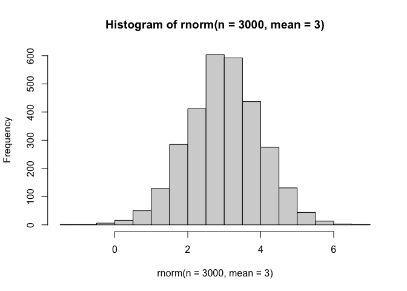

Make data `z` with two “clusters”

``` r
x <- c( rnorm(30, mean=-3), 
        rnorm(30, mean=+3) )

z <- cbind(x=x, y=rev(x))
head(z)
```

                 x         y
    [1,] -1.480471 3.0866434
    [2,] -2.486592 4.7730027
    [3,] -1.176367 2.4685721
    [4,] -4.078566 4.0818111
    [5,] -5.352669 0.1638837
    [6,] -3.883166 2.3038081

``` r
plot(z)
```

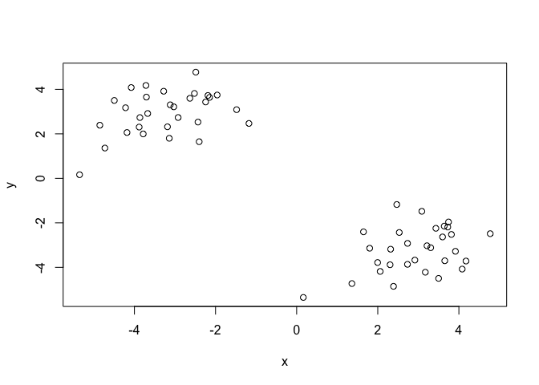

How big is `z`

``` r
nrow(z)
```

    [1] 60

``` r
ncol(z)
```

    [1] 2

## K-means clustering

The main function in “base” R for K-means clustering is called
`kmeans()`

``` r
k <- kmeans(z, centers = 2)
k
```

    K-means clustering with 2 clusters of sizes 30, 30

    Cluster means:
              x         y
    1  2.941743 -3.229384
    2 -3.229384  2.941743

    Clustering vector:
     [1] 2 2 2 2 2 2 2 2 2 2 2 2 2 2 2 2 2 2 2 2 2 2 2 2 2 2 2 2 2 2 1 1 1 1 1 1 1 1
    [39] 1 1 1 1 1 1 1 1 1 1 1 1 1 1 1 1 1 1 1 1 1 1

    Within cluster sum of squares by cluster:
    [1] 58.24119 58.24119
     (between_SS / total_SS =  90.7 %)

    Available components:

    [1] "cluster"      "centers"      "totss"        "withinss"     "tot.withinss"
    [6] "betweenss"    "size"         "iter"         "ifault"      

``` r
attributes(k)
```

    $names
    [1] "cluster"      "centers"      "totss"        "withinss"     "tot.withinss"
    [6] "betweenss"    "size"         "iter"         "ifault"      

    $class
    [1] "kmeans"

> Q. How many points lie in each cluster?

``` r
k$size
```

    [1] 30 30

> Q. What component of our results tells us about the cluster membership
> (i.e. which point likes in which cluster)?

``` r
k$cluster
```

     [1] 2 2 2 2 2 2 2 2 2 2 2 2 2 2 2 2 2 2 2 2 2 2 2 2 2 2 2 2 2 2 1 1 1 1 1 1 1 1
    [39] 1 1 1 1 1 1 1 1 1 1 1 1 1 1 1 1 1 1 1 1 1 1

> Q. Center of each cluster?

``` r
k$centers
```

              x         y
    1  2.941743 -3.229384
    2 -3.229384  2.941743

> Q. Put this result info together and make a little “base R” plot of
> our clustering result. Also add the cluster center points to this
> plot.

``` r
plot(z, col="blue")
```

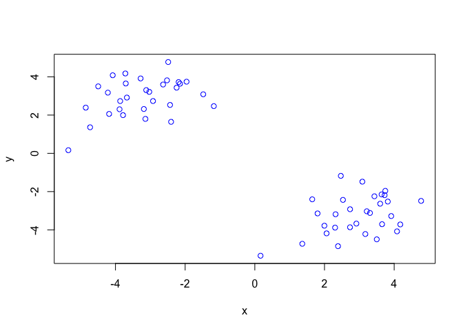

``` r
plot(z, col=c("blue","red"))
```

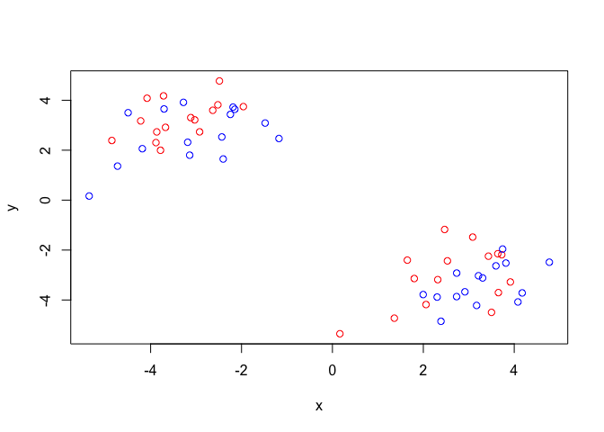

You can color by number.

``` r
plot(z, col=c(1,2))
```

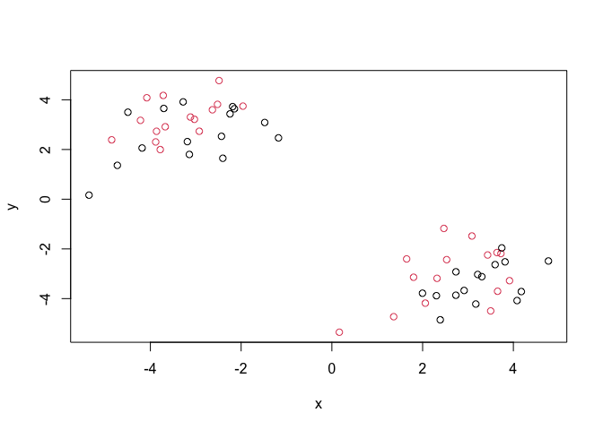

Plot colored by cluster membership:

``` r
plot(z, col=k$cluster)
points(k$centers, col="blue", pch=15)
```

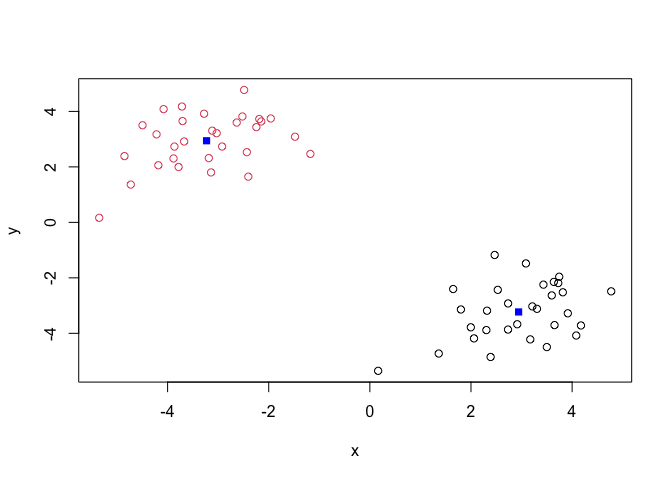

> Q. Run kmeans on our input `z` and define 4 clusters making the same
> result vizualization plot as above (plot of z collored by cluster
> memnbership).

``` r
k4 <- kmeans(z, centers = 4)
plot(z, col=k4$cluster)
```

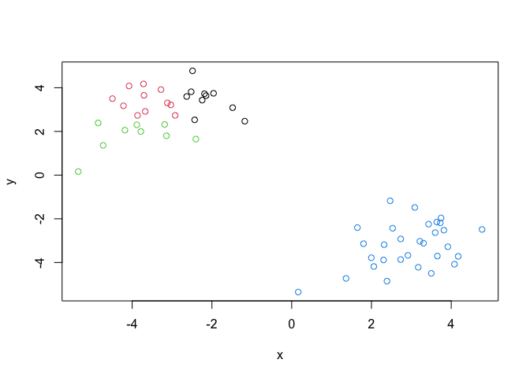

## Hierarchical Clustering

The main function in base R for this called `hclust()` it will take as
input a distance matrix (key point is that you can’t just give your
“raw” data as input - you have to first calculate a distance matrix from
your data).

``` r
d <- dist(z)
hc <- hclust(d)
hc
```


    Call:
    hclust(d = d)

    Cluster method   : complete 
    Distance         : euclidean 
    Number of objects: 60 

``` r
plot(hc)
abline(h=10, col="red")
```

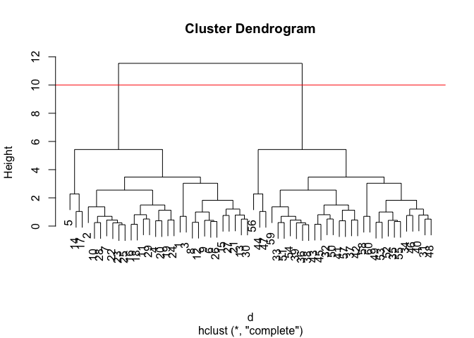

Once I inspect the “tree” I can “cut” the tree to yield my groupings or
clusters. The function to this is called `cutree()`

``` r
grps <- cutree(hc, h=10)
```

``` r
plot(z, col=grps)
```

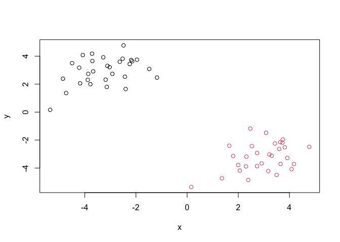

## Hands on with Principal Component Analysis (PCA)

Let’s examine some silly 17-dimensional data detailing food consumption
in the UK (England, Scotland, Wales and N. Ireland). Are these countries
eating habits different or similar and if so how?

### Data import

``` r
url <- "https://tinyurl.com/UK-foods"
x <- read.csv(url, row.names=1)
x
```

                        England Wales Scotland N.Ireland
    Cheese                  105   103      103        66
    Carcass_meat            245   227      242       267
    Other_meat              685   803      750       586
    Fish                    147   160      122        93
    Fats_and_oils           193   235      184       209
    Sugars                  156   175      147       139
    Fresh_potatoes          720   874      566      1033
    Fresh_Veg               253   265      171       143
    Other_Veg               488   570      418       355
    Processed_potatoes      198   203      220       187
    Processed_Veg           360   365      337       334
    Fresh_fruit            1102  1137      957       674
    Cereals                1472  1582     1462      1494
    Beverages                57    73       53        47
    Soft_drinks            1374  1256     1572      1506
    Alcoholic_drinks        375   475      458       135
    Confectionery            54    64       62        41

> Q1. How many rows and columns are in your new data frame named x? What
> R functions could you use to answer this questions?

``` r
nrow(x)
```

    [1] 17

``` r
ncol(x)
```

    [1] 4

``` r
dim(x)
```

    [1] 17  4

``` r
barplot(as.matrix(x), beside=T, col=rainbow(nrow(x)))
```


``` r
barplot(as.matrix(x), beside=F, col=rainbow(nrow(x)))
```


> Q5: Generating all pairwise plots may help somewhat. Can you make
> sense of the following code and resulting figure? What does it mean if
> a given point lies on the diagonal for a given plot?

``` r
pairs(x, col=rainbow(nrow(x)), pch=16)
```


Looking at these types of “pairwise plots” can be helpful but it does
not scale well and kind of sucks! There must be a better way…

### PCA to the rescue!

The main function for PCA in base R is called `prcomp()`. This function
wants the transpose of our input data - i.e. the important foods in as
columns and the countries as rows.

``` r
pca <- prcomp( t(x) )
summary(pca)
```

    Importance of components:
                                PC1      PC2      PC3       PC4
    Standard deviation     324.1502 212.7478 73.87622 2.921e-14
    Proportion of Variance   0.6744   0.2905  0.03503 0.000e+00
    Cumulative Proportion    0.6744   0.9650  1.00000 1.000e+00

Let’s see what is in our PCA result object `pca`

``` r
attributes(pca)
```

    $names
    [1] "sdev"     "rotation" "center"   "scale"    "x"       

    $class
    [1] "prcomp"

The `pca$x` result object is where we will focus first as this details
how the countries are related to each other in terms of our new “axis”
(a.k.a. “PCs”, “eigenvectors”, etc.)

``` r
head(pca$x)
```

                     PC1         PC2        PC3           PC4
    England   -144.99315   -2.532999 105.768945 -9.152022e-15
    Wales     -240.52915 -224.646925 -56.475555  5.560040e-13
    Scotland   -91.86934  286.081786 -44.415495 -6.638419e-13
    N.Ireland  477.39164  -58.901862  -4.877895  1.329771e-13

``` r
plot(pca$x[,1], pca$x[,2], pch=16,
     col=c("orange", "red", "blue", "darkgreen"),
     xlab="PC1", ylab="PC2")
```

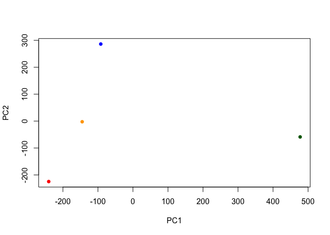

We can look at the so-called PC “loadings” result object to see how the
original foods contribute to our new PCs (i.e. how the original
variables contribute to our new better PC variables).

``` r
pca$rotation[,1]
```

                 Cheese       Carcass_meat          Other_meat                 Fish 
           -0.056955380         0.047927628        -0.258916658        -0.084414983 
         Fats_and_oils               Sugars     Fresh_potatoes           Fresh_Veg  
           -0.005193623        -0.037620983         0.401402060        -0.151849942 
             Other_Veg  Processed_potatoes       Processed_Veg         Fresh_fruit  
           -0.243593729        -0.026886233        -0.036488269        -0.632640898 
               Cereals            Beverages        Soft_drinks    Alcoholic_drinks  
           -0.047702858        -0.026187756         0.232244140        -0.463968168 
         Confectionery  
           -0.029650201 

# What about t(x) as input

``` r
y <- t(x)
dim(y)
```

    [1]  4 17

``` r
write.csv(y, file="uk_foods_T.csv")
```

``` r
food <- read.csv("uk_foods_T.csv", row.names = 1)
head(food)
```

              Cheese Carcass_meat. Other_meat. Fish Fats_and_oils. Sugars
    England      105           245         685  147            193    156
    Wales        103           227         803  160            235    175
    Scotland     103           242         750  122            184    147
    N.Ireland     66           267         586   93            209    139
              Fresh_potatoes. Fresh_Veg. Other_Veg. Processed_potatoes.
    England               720        253        488                 198
    Wales                 874        265        570                 203
    Scotland              566        171        418                 220
    N.Ireland            1033        143        355                 187
              Processed_Veg. Fresh_fruit. Cereals. Beverages Soft_drinks.
    England              360         1102     1472        57         1374
    Wales                365         1137     1582        73         1256
    Scotland             337          957     1462        53         1572
    N.Ireland            334          674     1494        47         1506
              Alcoholic_drinks. Confectionery.
    England                 375             54
    Wales                   475             64
    Scotland                458             62
    N.Ireland               135             41

``` r
#pairs(t(food))
barplot(as.matrix(food), col=as.factor(rownames(food)))
```

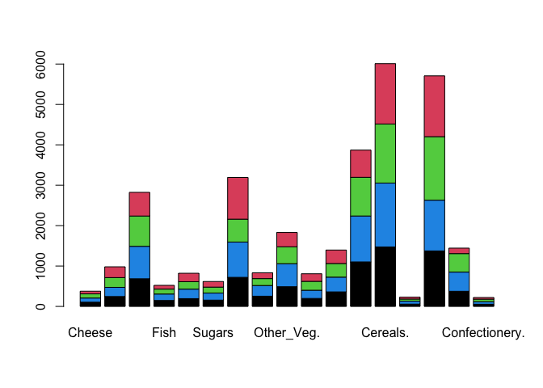

``` r
par(c(10,4,0,0))
```

    Warning in par(c(10, 4, 0, 0)): argument 1 does not name a graphical parameter

    NULL

``` r
barplot(as.matrix(food), 
        col=as.factor(rownames(food)), 
        beside=T, las=2)
```

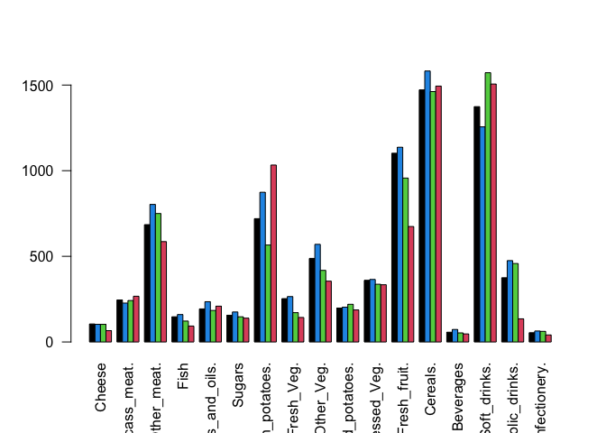

``` r
library(corrplot)
```

    corrplot 0.95 loaded

``` r
cij <- cor( t(x) )
corrplot(cij)
```

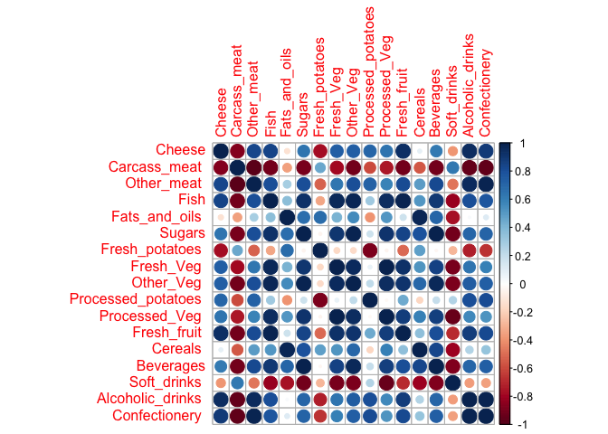
