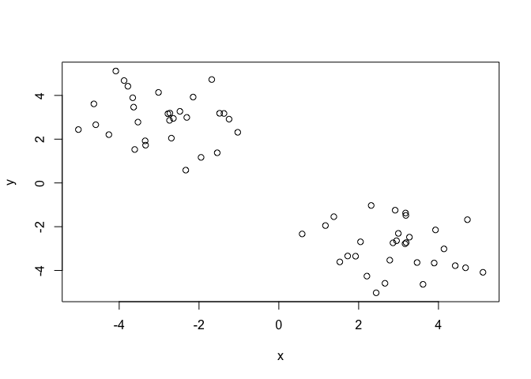
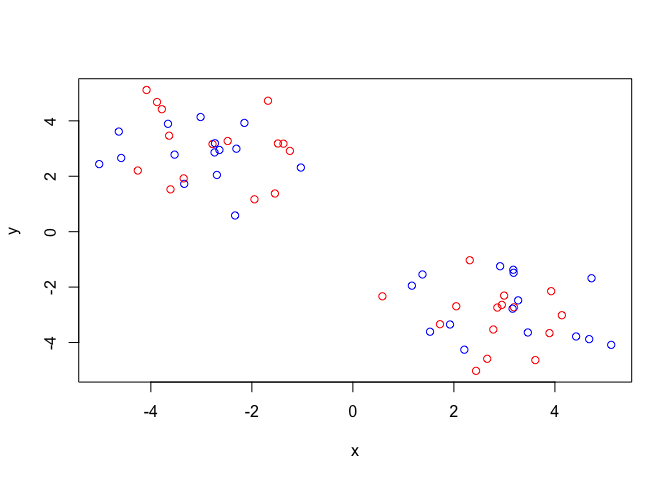
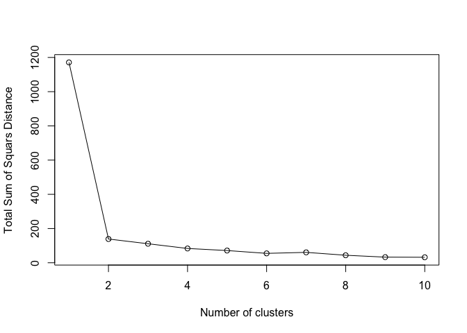
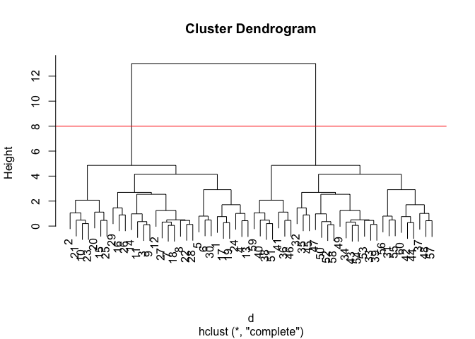
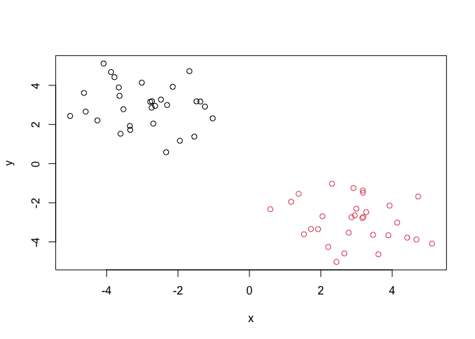
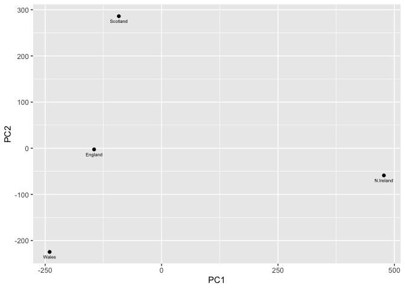

# Class 7: Machine Learning 1
Barry (PID: 911)

- [Background](#background)
- [K-means clustering](#k-means-clustering)
- [Hierarchical Clustering](#hierarchical-clustering)
- [Principal Component Analysis
  (PCA)](#principal-component-analysis-pca)
  - [Analysis of UK food data](#analysis-of-uk-food-data)
- [Data Import](#data-import)
- [Tidy the data](#tidy-the-data)
- [Exporatory analysis](#exporatory-analysis)
- [PCA to the rescue](#pca-to-the-rescue)

## Background

Today we will explore some core machine learning methods that are very
popular in bioinformatics. These include **clustering** and
**dimensionallity reduction**.

## K-means clustering

The main function in “base” R for K-means clustering is called
`kmeans()`

Before we go too deep let’s make up some “simple” data that we can
cluster and know if we are getting a good answer or not. To do this we
can use the `rnorm()` function:

``` r
hist( rnorm(10000, mean=3) )
```


``` r
x <- c( rnorm(30, -3), rnorm(30, +3) )

z <- cbind(x=x, y=rev(x))
plot(z)
```



Now we can run `kmeans()` on this input `z` and see what the results
look like.

``` r
km <- kmeans(z, centers = 2)
km
```

    K-means clustering with 2 clusters of sizes 30, 30

    Cluster means:
              x         y
    1 -2.918160  2.947583
    2  2.947583 -2.918160

    Clustering vector:
     [1] 1 1 1 1 1 1 1 1 1 1 1 1 1 1 1 1 1 1 1 1 1 1 1 1 1 1 1 1 1 1 2 2 2 2 2 2 2 2
    [39] 2 2 2 2 2 2 2 2 2 2 2 2 2 2 2 2 2 2 2 2 2 2

    Within cluster sum of squares by cluster:
    [1] 69.39086 69.39086
     (between_SS / total_SS =  88.1 %)

    Available components:

    [1] "cluster"      "centers"      "totss"        "withinss"     "tot.withinss"
    [6] "betweenss"    "size"         "iter"         "ifault"      

``` r
attributes(km)
```

    $names
    [1] "cluster"      "centers"      "totss"        "withinss"     "tot.withinss"
    [6] "betweenss"    "size"         "iter"         "ifault"      

    $class
    [1] "kmeans"

> Q. How many points are in each cluster?

``` r
km$size
```

    [1] 30 30

> Q. What “component of your result object details cluster
> assignment/membership?

``` r
km$cluster
```

     [1] 1 1 1 1 1 1 1 1 1 1 1 1 1 1 1 1 1 1 1 1 1 1 1 1 1 1 1 1 1 1 2 2 2 2 2 2 2 2
    [39] 2 2 2 2 2 2 2 2 2 2 2 2 2 2 2 2 2 2 2 2 2 2

> Q. What “component of your result object details cluster center?

``` r
km$centers
```

              x         y
    1 -2.918160  2.947583
    2  2.947583 -2.918160

> Q. Plot `z` colored by the kmeans cluster assignment and add cluster
> centers as blue points

``` r
plot(z, col=c("red","blue") )
```



``` r
plot(z, col=km$cluster)
points(km$centers, col="blue", pch=15)
```


> Q. Run a K-means clustering and plot the results asking for 4 clusters
> (K=4)?

``` r
km4 <- kmeans(z, centers = 4)
plot(z, col=km4$cluster)
points(km4$centers, col="black", pch=15)
```


> **N.B.** You need to tell K-means the number of clusters (i.e. set
> `centers=2`)!!

One approach is to try different values for `centers` and then pick the
best…

``` r
ans <- NULL
for(i in 1:10) {
  km <- kmeans(z, centers=i)
  ans <- c(ans, km$tot.withinss)
}

plot(ans, typ="o", 
     xlab="Number of clusters",
     ylab="Total Sum of Squars Distance")
```



## Hierarchical Clustering

The main function in “base” R for Hierarchical Clustering is called
`hclust()`

This function does not take your “raw” data for clustering. You must
first build a “distance matrix” from your data and pass this as input to
`hclust()`

``` r
d <- dist(z)
hc <- hclust(d)
hc
```


    Call:
    hclust(d = d)

    Cluster method   : complete 
    Distance         : euclidean 
    Number of objects: 60 

There is a bespoke `plot()` method for `hclust()` result objects.

``` r
plot(hc)
abline(h=8, col="red")
```



Once we have our `hclust` object (our “tree” of “cluster dendrogram”) we
can *“cut”* the tree to reval the clustering pattern.

``` r
cutree(hc, h=8)
```

     [1] 1 1 1 1 1 1 1 1 1 1 1 1 1 1 1 1 1 1 1 1 1 1 1 1 1 1 1 1 1 1 2 2 2 2 2 2 2 2
    [39] 2 2 2 2 2 2 2 2 2 2 2 2 2 2 2 2 2 2 2 2 2 2

``` r
cutree(hc, k=4)
```

     [1] 1 2 1 1 1 1 1 1 1 2 1 1 1 1 2 1 1 1 1 2 2 1 2 1 2 1 1 1 1 1 3 3 3 3 3 4 3 4
    [39] 3 4 4 3 3 3 3 4 3 3 3 3 4 3 3 3 3 3 3 3 4 3

> Q. Make a plot of `z` with your hclust results (i.e. colored by
> cluster membership)

``` r
grps <- cutree(hc, k=2)
plot(z, col=grps)
```



## Principal Component Analysis (PCA)

PCA is a dimensionallity reduction method that is popular for revealing
patterns in complex datasets.

### Analysis of UK food data

Let’s look at some data on the eating habits of folks from the UK to see
if there are patterns and trends that have some regions being distinct
from others.

## Data Import

The data is made availabe in CSV format so we can use the `read.csv()`
function for import to R:

``` r
url <- "https://tinyurl.com/UK-foods"
x <- read.csv(url)
```

``` r
row.names(x) <- x[,1]
x <- x[,-1]
x
```

                        England Wales Scotland N.Ireland
    Cheese                  105   103      103        66
    Carcass_meat            245   227      242       267
    Other_meat              685   803      750       586
    Fish                    147   160      122        93
    Fats_and_oils           193   235      184       209
    Sugars                  156   175      147       139
    Fresh_potatoes          720   874      566      1033
    Fresh_Veg               253   265      171       143
    Other_Veg               488   570      418       355
    Processed_potatoes      198   203      220       187
    Processed_Veg           360   365      337       334
    Fresh_fruit            1102  1137      957       674
    Cereals                1472  1582     1462      1494
    Beverages                57    73       53        47
    Soft_drinks            1374  1256     1572      1506
    Alcoholic_drinks        375   475      458       135
    Confectionery            54    64       62        41

> Q1. How many rows and columns are in your new data frame named x? What
> R functions could you use to answer this questions?

``` r
x <- read.csv(url, row.names=1)
```

## Tidy the data

Fix anything that went wrong with data import.

> Q2. Which approach to solving the ‘row-names problem’ mentioned above
> do you prefer and why? Is one approach more robust than another under
> certain circumstances?

## Exporatory analysis

Make some plots to help make sense of obvious trends…

> Q5. We can use the `pairs()` function to generate all pairwise plots
> for our countries. Can you make sense of the following code and
> resulting figure? What does it mean if a given point lies on the
> diagonal for a given plot?

``` r
pairs(x, col=rainbow(nrow(x)), pch=16)
```


``` r
library(pheatmap)

pheatmap( as.matrix(x) )
```


> **Key-point**: Even relatively small datasets can prove challenging to
> interpret.

## PCA to the rescue

The main function in “base” R for PCA is called `prcomp()`. This
function wants the “observations” to be rows and the “variables” to be
columns.

So here we need to take the transpose of our `x` input object

``` r
pca <- prcomp( t(x) )
summary(pca)
```

    Importance of components:
                                PC1      PC2      PC3       PC4
    Standard deviation     324.1502 212.7478 73.87622 2.921e-14
    Proportion of Variance   0.6744   0.2905  0.03503 0.000e+00
    Cumulative Proportion    0.6744   0.9650  1.00000 1.000e+00

The returned `pca` object has components that we can use to make our
main result figures:

``` r
attributes(pca)
```

    $names
    [1] "sdev"     "rotation" "center"   "scale"    "x"       

    $class
    [1] "prcomp"

The main result figure from this analysis is called a **“PC score
plot”** (a.k.a. an “ordination plot”, “PC plot” or simply “PC1 vs PC2
plot”).

This plot shows how samples (in this case countries) relate to each
other along our new PC axis.

This is our new “reduced-dimensional space”. In this case 2 dimensions,
PC1 and PC2, that capture most of the variance in the original 17
dimensional data-set.

``` r
library(ggplot2)
```

    Warning: package 'ggplot2' was built under R version 4.4.3

``` r
ggplot(pca$x) +
  aes(PC1, PC2) +
  geom_point() 
```


``` r
mycols <- c("orange", "red", "blue", "darkgreen")

ggplot(pca$x) +
  aes(PC1, PC2) +
  geom_point(col=mycols)
```


``` r
ggplot(pca$x) +
  aes(PC1, PC2, label=row.names(pca$x)) +
  geom_point(col=mycols) +
  geom_text(size=3, vjust=2, col=mycols)
```


``` r
ggplot(pca$x) +
  aes(PC1, PC2, label=row.names(pca$x)) +
  geom_point() +
  geom_text(size = 2,vjust = 2)
```



``` r
ggplot(pca$rotation) +
  aes(PC1, 
      reorder( row.names(pca$rotation), PC1) ) +
  geom_col()
```


