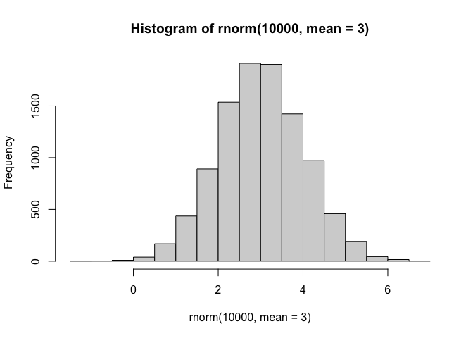
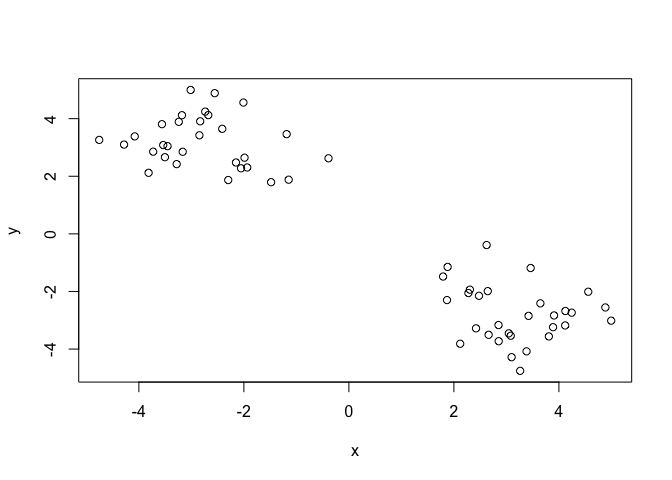
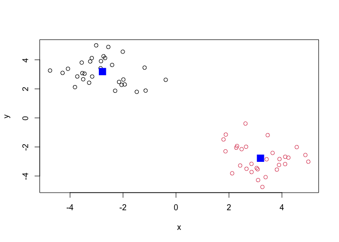
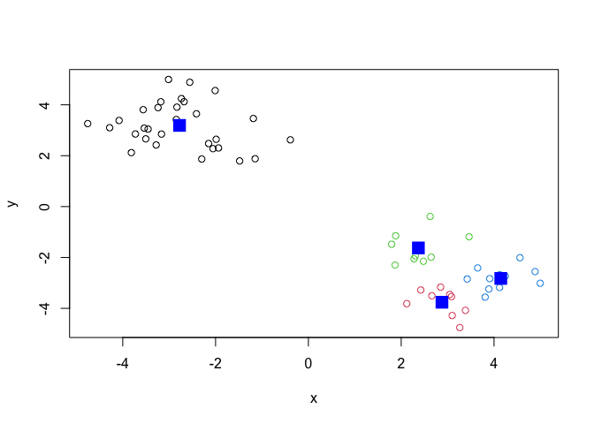
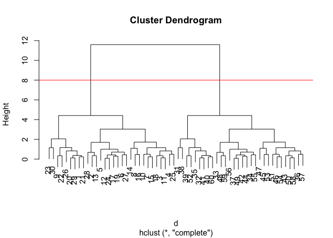
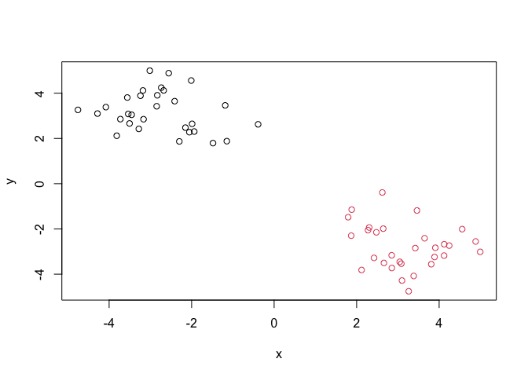
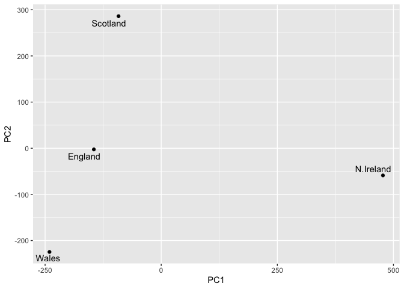

# Class 7: Machine Learning 1
Barry

- [Clustering](#clustering)
  - [K-means](#k-means)
  - [Hierarchical Clustering](#hierarchical-clustering)
- [Principal Component Analysis
  (PCA)](#principal-component-analysis-pca)
  - [Data import](#data-import)
  - [PCA to the rescue](#pca-to-the-rescue)
  - [Interperting PCA Results](#interperting-pca-results)

Today we will explore unsupervised machine learning methods starting
with clustering and dimensionality reduction.

## Clustering

To start let’s make up some data to cluster where we know what the
answer should be. The `rnorm()` function will help us here.

``` r
hist( rnorm(10000, mean=3) )
```



Return 30 numbers centred on -3

``` r
tmp <- c( rnorm(30, mean=-3),
          rnorm(30, mean=+3) )

x <- cbind(x=tmp, y=rev(tmp))

x
```

                  x         y
     [1,] -1.987870  2.645181
     [2,] -4.282244  3.099341
     [3,] -2.678279  4.122998
     [4,] -2.847117  3.422011
     [5,] -3.815052  2.119893
     [6,] -3.165403  2.849571
     [7,] -3.240108  3.888634
     [8,] -3.013817  4.996137
     [9,] -1.481707  1.794225
    [10,] -3.559943  3.808479
    [11,] -2.736155  4.243754
    [12,] -3.536462  3.082896
    [13,] -4.079371  3.383496
    [14,] -2.009034  4.559023
    [15,] -3.179543  4.119823
    [16,] -2.555200  4.885178
    [17,] -3.503995  2.661561
    [18,] -2.832338  3.907725
    [19,] -3.727421  2.853252
    [20,] -1.936765  2.304370
    [21,] -2.150351  2.477658
    [22,] -1.147323  1.880307
    [23,] -0.388228  2.623201
    [24,] -3.454201  3.045229
    [25,] -2.412102  3.647291
    [26,] -2.298350  1.868660
    [27,] -3.279956  2.421764
    [28,] -4.755762  3.261844
    [29,] -2.054573  2.276722
    [30,] -1.185548  3.461922
    [31,]  3.461922 -1.185548
    [32,]  2.276722 -2.054573
    [33,]  3.261844 -4.755762
    [34,]  2.421764 -3.279956
    [35,]  1.868660 -2.298350
    [36,]  3.647291 -2.412102
    [37,]  3.045229 -3.454201
    [38,]  2.623201 -0.388228
    [39,]  1.880307 -1.147323
    [40,]  2.477658 -2.150351
    [41,]  2.304370 -1.936765
    [42,]  2.853252 -3.727421
    [43,]  3.907725 -2.832338
    [44,]  2.661561 -3.503995
    [45,]  4.885178 -2.555200
    [46,]  4.119823 -3.179543
    [47,]  4.559023 -2.009034
    [48,]  3.383496 -4.079371
    [49,]  3.082896 -3.536462
    [50,]  4.243754 -2.736155
    [51,]  3.808479 -3.559943
    [52,]  1.794225 -1.481707
    [53,]  4.996137 -3.013817
    [54,]  3.888634 -3.240108
    [55,]  2.849571 -3.165403
    [56,]  2.119893 -3.815052
    [57,]  3.422011 -2.847117
    [58,]  4.122998 -2.678279
    [59,]  3.099341 -4.282244
    [60,]  2.645181 -1.987870

Make a plot of `x`

``` r
plot(x)
```



### K-means

The main function in “base” R for K-means clustering is called
`kmeans()`:

``` r
km <- kmeans(x, centers = 2)
km
```

    K-means clustering with 2 clusters of sizes 30, 30

    Cluster means:
              x         y
    1 -2.776474  3.190405
    2  3.190405 -2.776474

    Clustering vector:
     [1] 1 1 1 1 1 1 1 1 1 1 1 1 1 1 1 1 1 1 1 1 1 1 1 1 1 1 1 1 1 1 2 2 2 2 2 2 2 2
    [39] 2 2 2 2 2 2 2 2 2 2 2 2 2 2 2 2 2 2 2 2 2 2

    Within cluster sum of squares by cluster:
    [1] 51.76662 51.76662
     (between_SS / total_SS =  91.2 %)

    Available components:

    [1] "cluster"      "centers"      "totss"        "withinss"     "tot.withinss"
    [6] "betweenss"    "size"         "iter"         "ifault"      

The `kmeans()` function return a “list” with 9 components. You can see
the named components of any list with the `attributes()` function.

``` r
attributes(km)
```

    $names
    [1] "cluster"      "centers"      "totss"        "withinss"     "tot.withinss"
    [6] "betweenss"    "size"         "iter"         "ifault"      

    $class
    [1] "kmeans"

> Q. How many points are in each cluster?

``` r
km$size
```

    [1] 30 30

> Q. Cluster assignment/membership vector?

``` r
km$cluster
```

     [1] 1 1 1 1 1 1 1 1 1 1 1 1 1 1 1 1 1 1 1 1 1 1 1 1 1 1 1 1 1 1 2 2 2 2 2 2 2 2
    [39] 2 2 2 2 2 2 2 2 2 2 2 2 2 2 2 2 2 2 2 2 2 2

> Q. Cluster centers?

``` r
km$centers
```

              x         y
    1 -2.776474  3.190405
    2  3.190405 -2.776474

> Q. Make a plot of our `kmeans()` results showing cluster assignment
> using different colors for each cluster/group of points and cluster
> centers in blue.

``` r
plot(x, col=km$cluster )
points(km$centers, col="blue", pch=15, cex=2)
```



> Q. Run `kmeans()` again on `x` and this cluster into 4 groups/clusters
> and plot the same result figure as above.

``` r
km4 <- kmeans(x, centers = 4)
plot(x, col=km4$cluster )
points(km4$centers, col="blue", pch=15, cex=2)
```



> **key-point**: K-means clustering is supper popular but can be
> miss-used. One big limmitation is that it can impose a clustering
> pattern on your data even if clear natural grouping don’t exist -
> i.e. it does what you tell it to do in therms of `centers`.

### Hierarchical Clustering

The main function in “base” R for hierarchical clustering is called
`hclust()`.

You can’t just pass our dataset as is into `hclust()` you must give
“distance matrix” as input. We can get this from the `dist()` function
in R.

``` r
d <- dist(x)
hc <- hclust(d)
hc
```


    Call:
    hclust(d = d)

    Cluster method   : complete 
    Distance         : euclidean 
    Number of objects: 60 

The results of `hclust()` don’t have a useful `print()` method but do
have a special `plot()` method.

``` r
plot(hc)
abline(h=8, col="red")
```



To get our main cluster assignment (membership vector) we need to “cut”
the tree at the big goal posts…

``` r
grps <- cutree(hc, h=8)
grps
```

     [1] 1 1 1 1 1 1 1 1 1 1 1 1 1 1 1 1 1 1 1 1 1 1 1 1 1 1 1 1 1 1 2 2 2 2 2 2 2 2
    [39] 2 2 2 2 2 2 2 2 2 2 2 2 2 2 2 2 2 2 2 2 2 2

``` r
table(grps)
```

    grps
     1  2 
    30 30 

``` r
plot(x, col=grps)
```



Hierarchical clustering is distinct in that the dendrogram (tree figure)
can reveal the potential grouping in your data (unlike K-means)

## Principal Component Analysis (PCA)

PCA is a common and highly useful dimensionality reduction technique
used in many fields - particullary bioinformatics.

Here we will analyze some data from the UK on food consumption.

### Data import

``` r
url <- "https://tinyurl.com/UK-foods"
x <- read.csv(url)

head(x)
```

                   X England Wales Scotland N.Ireland
    1         Cheese     105   103      103        66
    2  Carcass_meat      245   227      242       267
    3    Other_meat      685   803      750       586
    4           Fish     147   160      122        93
    5 Fats_and_oils      193   235      184       209
    6         Sugars     156   175      147       139

``` r
rownames(x) <- x[,1]
x <- x[,-1]
head(x)
```

                   England Wales Scotland N.Ireland
    Cheese             105   103      103        66
    Carcass_meat       245   227      242       267
    Other_meat         685   803      750       586
    Fish               147   160      122        93
    Fats_and_oils      193   235      184       209
    Sugars             156   175      147       139

``` r
x <- read.csv(url, row.names = 1)
head(x)
```

                   England Wales Scotland N.Ireland
    Cheese             105   103      103        66
    Carcass_meat       245   227      242       267
    Other_meat         685   803      750       586
    Fish               147   160      122        93
    Fats_and_oils      193   235      184       209
    Sugars             156   175      147       139

``` r
barplot(as.matrix(x), beside=T, col=rainbow(nrow(x)))
```


``` r
barplot(as.matrix(x), beside=F, col=rainbow(nrow(x)))
```


One conventional plot that can be useful is called a “paris” plot.

``` r
pairs(x, col=rainbow(nrow(x)), pch=16)
```


### PCA to the rescue

The main function in base R for PCA is called `prcomp()`.

``` r
pca <- prcomp( t(x) )
summary(pca)
```

    Importance of components:
                                PC1      PC2      PC3       PC4
    Standard deviation     324.1502 212.7478 73.87622 2.921e-14
    Proportion of Variance   0.6744   0.2905  0.03503 0.000e+00
    Cumulative Proportion    0.6744   0.9650  1.00000 1.000e+00

### Interperting PCA Results

The `prcomp()` fucntion returns a list object of our results with five
attributes/components

``` r
attributes(pca)
```

    $names
    [1] "sdev"     "rotation" "center"   "scale"    "x"       

    $class
    [1] "prcomp"

The two main “results” in here are `pca$x` and `pca$rotation`. The first
of these (`pca$x`) contains the scores of the data on the new PC axis -
we use these to make our “PCA plot”.

``` r
pca$x
```

                     PC1         PC2        PC3           PC4
    England   -144.99315   -2.532999 105.768945 -9.152022e-15
    Wales     -240.52915 -224.646925 -56.475555  5.560040e-13
    Scotland   -91.86934  286.081786 -44.415495 -6.638419e-13
    N.Ireland  477.39164  -58.901862  -4.877895  1.329771e-13

``` r
library(ggplot2)
library(ggrepel)

# Make a plot of pca$x with PC1 vs PC2
ggplot(pca$x) +
  aes(PC1, PC2, label=rownames(pca$x)) +
  geom_point() +
  geom_text_repel()
```



The second major result is contained in the `pca$rotation` object or
component. Let’s plot this to see what PCA is picking up…

``` r
ggplot(pca$rotation) +
  aes(PC1, rownames(pca$rotation)) +
  geom_col()
```


