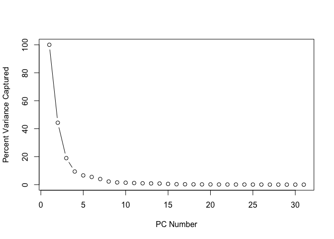
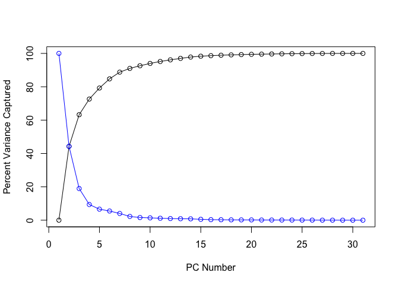
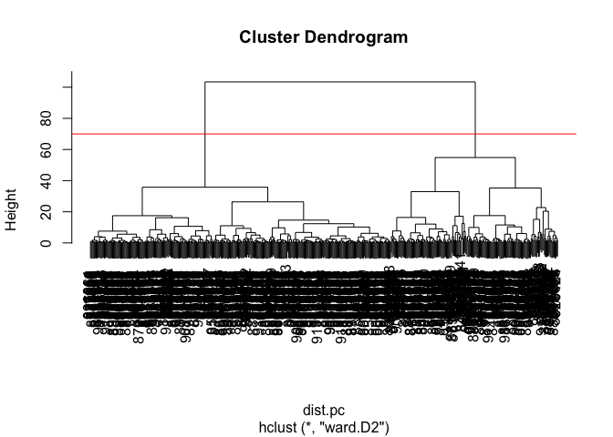

# Class 8: Breast Cancer Analysis Mini Project
Barry (PID: 911)

- [Background](#background)
- [Data import](#data-import)
- [Data exploration](#data-exploration)
- [Principal Component Analysis
  (PCA)](#principal-component-analysis-pca)
  - [PCA Score Plot](#pca-score-plot)
- [PCA Scree-plot](#pca-scree-plot)
  - [Communicating PCA results](#communicating-pca-results)
- [Hierarchical clustering](#hierarchical-clustering)
- [Combining methods (PCA and
  Clustering)](#combining-methods-pca-and-clustering)
- [7. Prediction](#7-prediction)

## Background

The goal of this mini-project is to explore a complete analysis using
the unsupervised learning techniques covered in our last class.

The data itself comes from the Wisconsin Breast Cancer Diagnostic Data
Set first reported by K. P. Benne and O. L. Mangasarian: “Robust Linear
Programming Discrimination of Two Linearly Inseparable Sets”.

Values in this data set describe characteristics of the cell nuclei
present in digitized images of a fine needle aspiration (FNA) of a
breast mass.

## Data import

Data was downloaded from the class website as a CSV file.

``` r
wisc.df <- read.csv("WisconsinCancer.csv", row.names=1)
head(wisc.df)
```

             diagnosis radius_mean texture_mean perimeter_mean area_mean
    842302           M       17.99        10.38         122.80    1001.0
    842517           M       20.57        17.77         132.90    1326.0
    84300903         M       19.69        21.25         130.00    1203.0
    84348301         M       11.42        20.38          77.58     386.1
    84358402         M       20.29        14.34         135.10    1297.0
    843786           M       12.45        15.70          82.57     477.1
             smoothness_mean compactness_mean concavity_mean concave.points_mean
    842302           0.11840          0.27760         0.3001             0.14710
    842517           0.08474          0.07864         0.0869             0.07017
    84300903         0.10960          0.15990         0.1974             0.12790
    84348301         0.14250          0.28390         0.2414             0.10520
    84358402         0.10030          0.13280         0.1980             0.10430
    843786           0.12780          0.17000         0.1578             0.08089
             symmetry_mean fractal_dimension_mean radius_se texture_se perimeter_se
    842302          0.2419                0.07871    1.0950     0.9053        8.589
    842517          0.1812                0.05667    0.5435     0.7339        3.398
    84300903        0.2069                0.05999    0.7456     0.7869        4.585
    84348301        0.2597                0.09744    0.4956     1.1560        3.445
    84358402        0.1809                0.05883    0.7572     0.7813        5.438
    843786          0.2087                0.07613    0.3345     0.8902        2.217
             area_se smoothness_se compactness_se concavity_se concave.points_se
    842302    153.40      0.006399        0.04904      0.05373           0.01587
    842517     74.08      0.005225        0.01308      0.01860           0.01340
    84300903   94.03      0.006150        0.04006      0.03832           0.02058
    84348301   27.23      0.009110        0.07458      0.05661           0.01867
    84358402   94.44      0.011490        0.02461      0.05688           0.01885
    843786     27.19      0.007510        0.03345      0.03672           0.01137
             symmetry_se fractal_dimension_se radius_worst texture_worst
    842302       0.03003             0.006193        25.38         17.33
    842517       0.01389             0.003532        24.99         23.41
    84300903     0.02250             0.004571        23.57         25.53
    84348301     0.05963             0.009208        14.91         26.50
    84358402     0.01756             0.005115        22.54         16.67
    843786       0.02165             0.005082        15.47         23.75
             perimeter_worst area_worst smoothness_worst compactness_worst
    842302            184.60     2019.0           0.1622            0.6656
    842517            158.80     1956.0           0.1238            0.1866
    84300903          152.50     1709.0           0.1444            0.4245
    84348301           98.87      567.7           0.2098            0.8663
    84358402          152.20     1575.0           0.1374            0.2050
    843786            103.40      741.6           0.1791            0.5249
             concavity_worst concave.points_worst symmetry_worst
    842302            0.7119               0.2654         0.4601
    842517            0.2416               0.1860         0.2750
    84300903          0.4504               0.2430         0.3613
    84348301          0.6869               0.2575         0.6638
    84358402          0.4000               0.1625         0.2364
    843786            0.5355               0.1741         0.3985
             fractal_dimension_worst
    842302                   0.11890
    842517                   0.08902
    84300903                 0.08758
    84348301                 0.17300
    84358402                 0.07678
    843786                   0.12440

## Data exploration

The first column `diagnosis` is the expert opinion on the sample
(i.e. patient FNA).

``` r
head(wisc.df$diagnosis)
```

    [1] "M" "M" "M" "M" "M" "M"

Remove the diagnosis from data for subsequent analysis

``` r
wisc.data <- wisc.df[,-1]
dim(wisc.data)
```

    [1] 569  30

Store the diagnosis as a vector for use later when we compare our
results to those from experts in the field.

``` r
diagnosis <- factor(wisc.df$diagnosis)
```

> Q1. How many observations are in this dataset?

There are 569 observations/patients in the dataset

> Q2. How many of the observations have a malignant diagnosis?

``` r
table(wisc.df$diagnosis)
```


      B   M 
    357 212 

> Q3. How many variables/features in the data are suffixed with \_mean?

``` r
#colnames(wisc.data)
length( grep("_mean", colnames(wisc.data)) )
```

    [1] 10

## Principal Component Analysis (PCA)

The `prcomp()` function to do PCA has a `scale=FALSE` default. In
general we nearrly always want to set this to TRUE so our analysis is
not dominated by columns/variables in our dataset that have high
standard deviation and mean when compared to others just because the
units of measurments are on different units/scales.

``` r
wisc.pr <- prcomp(wisc.data, scale=TRUE )
summary(wisc.pr)
```

    Importance of components:
                              PC1    PC2     PC3     PC4     PC5     PC6     PC7
    Standard deviation     3.6444 2.3857 1.67867 1.40735 1.28403 1.09880 0.82172
    Proportion of Variance 0.4427 0.1897 0.09393 0.06602 0.05496 0.04025 0.02251
    Cumulative Proportion  0.4427 0.6324 0.72636 0.79239 0.84734 0.88759 0.91010
                               PC8    PC9    PC10   PC11    PC12    PC13    PC14
    Standard deviation     0.69037 0.6457 0.59219 0.5421 0.51104 0.49128 0.39624
    Proportion of Variance 0.01589 0.0139 0.01169 0.0098 0.00871 0.00805 0.00523
    Cumulative Proportion  0.92598 0.9399 0.95157 0.9614 0.97007 0.97812 0.98335
                              PC15    PC16    PC17    PC18    PC19    PC20   PC21
    Standard deviation     0.30681 0.28260 0.24372 0.22939 0.22244 0.17652 0.1731
    Proportion of Variance 0.00314 0.00266 0.00198 0.00175 0.00165 0.00104 0.0010
    Cumulative Proportion  0.98649 0.98915 0.99113 0.99288 0.99453 0.99557 0.9966
                              PC22    PC23   PC24    PC25    PC26    PC27    PC28
    Standard deviation     0.16565 0.15602 0.1344 0.12442 0.09043 0.08307 0.03987
    Proportion of Variance 0.00091 0.00081 0.0006 0.00052 0.00027 0.00023 0.00005
    Cumulative Proportion  0.99749 0.99830 0.9989 0.99942 0.99969 0.99992 0.99997
                              PC29    PC30
    Standard deviation     0.02736 0.01153
    Proportion of Variance 0.00002 0.00000
    Cumulative Proportion  1.00000 1.00000

### PCA Score Plot

The main PC result figure is called a “score plot” or “PC plot” or
“ordination plot”…

``` r
library(ggplot2)

ggplot(wisc.pr$x) +
  aes(PC1, PC2, col=diagnosis) +
  geom_point()
```


## PCA Scree-plot

A plot of how much variance each PC captures. We can get this from
`wisc.pr$sdev` or from the output of `summary(wisc.pr)`

``` r
var.tbl <- summary(wisc.pr)
head(var.tbl$importance)
```

                                PC1      PC2      PC3      PC4      PC5      PC6
    Standard deviation     3.644394 2.385656 1.678675 1.407352 1.284029 1.098798
    Proportion of Variance 0.442720 0.189710 0.093930 0.066020 0.054960 0.040250
    Cumulative Proportion  0.442720 0.632430 0.726360 0.792390 0.847340 0.887590
                                 PC7       PC8       PC9      PC10      PC11
    Standard deviation     0.8217178 0.6903746 0.6456739 0.5921938 0.5421399
    Proportion of Variance 0.0225100 0.0158900 0.0139000 0.0116900 0.0098000
    Cumulative Proportion  0.9101000 0.9259800 0.9398800 0.9515700 0.9613700
                                PC12      PC13      PC14      PC15      PC16
    Standard deviation     0.5110395 0.4912815 0.3962445 0.3068142 0.2826001
    Proportion of Variance 0.0087100 0.0080500 0.0052300 0.0031400 0.0026600
    Cumulative Proportion  0.9700700 0.9781200 0.9833500 0.9864900 0.9891500
                                PC17      PC18      PC19      PC20      PC21
    Standard deviation     0.2437192 0.2293878 0.2224356 0.1765203 0.1731268
    Proportion of Variance 0.0019800 0.0017500 0.0016500 0.0010400 0.0010000
    Cumulative Proportion  0.9911300 0.9928800 0.9945300 0.9955700 0.9965700
                                PC22      PC23      PC24      PC25      PC26
    Standard deviation     0.1656484 0.1560155 0.1343689 0.1244238 0.0904303
    Proportion of Variance 0.0009100 0.0008100 0.0006000 0.0005200 0.0002700
    Cumulative Proportion  0.9974900 0.9983000 0.9989000 0.9994200 0.9996900
                                 PC27      PC28       PC29       PC30
    Standard deviation     0.08306903 0.0398665 0.02736427 0.01153451
    Proportion of Variance 0.00023000 0.0000500 0.00002000 0.00000000
    Cumulative Proportion  0.99992000 0.9999700 1.00000000 1.00000000

``` r
var <- c(1, var.tbl$importance[2,])
cum.var <- c(0, var.tbl$importance[3,])

plot(var * 100, typ="b", 
     ylab="Percent Variance Captured",
     xlab="PC Number")
```



``` r
plot(cum.var * 100, typ="o", 
     ylab="Percent Variance Captured",
     xlab="PC Number",
     ylim=c(0,100))
points(var * 100, col="blue", typ="o")
```



### Communicating PCA results

> Q9. For the first principal component, what is the component of the
> loading vector (i.e. wisc.pr\$rotation\[,1\]) for the feature
> concave.points_mean?

``` r
wisc.pr$rotation["concave.points_mean", "PC1"]
```

    [1] -0.2608538

> Q10. What is the minimum number of principal components required to
> explain 80% of the variance of the data?

We need 5 PCs to capture more than 80% variance

``` r
summary(wisc.pr)
```

    Importance of components:
                              PC1    PC2     PC3     PC4     PC5     PC6     PC7
    Standard deviation     3.6444 2.3857 1.67867 1.40735 1.28403 1.09880 0.82172
    Proportion of Variance 0.4427 0.1897 0.09393 0.06602 0.05496 0.04025 0.02251
    Cumulative Proportion  0.4427 0.6324 0.72636 0.79239 0.84734 0.88759 0.91010
                               PC8    PC9    PC10   PC11    PC12    PC13    PC14
    Standard deviation     0.69037 0.6457 0.59219 0.5421 0.51104 0.49128 0.39624
    Proportion of Variance 0.01589 0.0139 0.01169 0.0098 0.00871 0.00805 0.00523
    Cumulative Proportion  0.92598 0.9399 0.95157 0.9614 0.97007 0.97812 0.98335
                              PC15    PC16    PC17    PC18    PC19    PC20   PC21
    Standard deviation     0.30681 0.28260 0.24372 0.22939 0.22244 0.17652 0.1731
    Proportion of Variance 0.00314 0.00266 0.00198 0.00175 0.00165 0.00104 0.0010
    Cumulative Proportion  0.98649 0.98915 0.99113 0.99288 0.99453 0.99557 0.9966
                              PC22    PC23   PC24    PC25    PC26    PC27    PC28
    Standard deviation     0.16565 0.15602 0.1344 0.12442 0.09043 0.08307 0.03987
    Proportion of Variance 0.00091 0.00081 0.0006 0.00052 0.00027 0.00023 0.00005
    Cumulative Proportion  0.99749 0.99830 0.9989 0.99942 0.99969 0.99992 0.99997
                              PC29    PC30
    Standard deviation     0.02736 0.01153
    Proportion of Variance 0.00002 0.00000
    Cumulative Proportion  1.00000 1.00000

## Hierarchical clustering

Just clustering the origional data is not very informative or helpful.

``` r
data.scaled <- scale(wisc.data)
data.dist <- dist(data.scaled)
wisc.hclust <- hclust(data.dist)
```

View the clustering dendrogram result

``` r
plot(wisc.hclust)
```


``` r
wisc.hclust.clusters <- cutree(wisc.hclust, k=4)
table( wisc.hclust.clusters )
```

    wisc.hclust.clusters
      1   2   3   4 
    177   7 383   2 

``` r
table(wisc.hclust.clusters, diagnosis)
```

                        diagnosis
    wisc.hclust.clusters   B   M
                       1  12 165
                       2   2   5
                       3 343  40
                       4   0   2

## Combining methods (PCA and Clustering)

Clustering the origional data was not very productive. The PCA results
looked promising. Here we combine these methods by clustering from our
PCA results. In other words “clustering in PC space”…

``` r
## Take the first 3 PCs
dist.pc <- dist( wisc.pr$x[,1:3] )
wisc.pr.hclust <- hclust(dist.pc, method="ward.D2")
```

View the tree…

``` r
plot(wisc.pr.hclust)
abline(h=70, col="red")
```



To get our clustering membership vector (i.e. our main clustering
result) we “cut” the tree at a desired height or to yield a desired
number of “k” groups.

``` r
grps <- cutree(wisc.pr.hclust, h=70)
table(grps)
```

    grps
      1   2 
    203 366 

How does this clustering grps compare to the expert diagnosis

``` r
table(grps, diagnosis)
```

        diagnosis
    grps   B   M
       1  24 179
       2 333  33

Sensitivity: TP/(TP+FN) Specificity: TN/(TN+FN)

## 7. Prediction

We can use our PCA model for prediction with new input patient samples.
