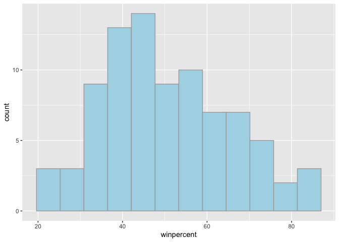
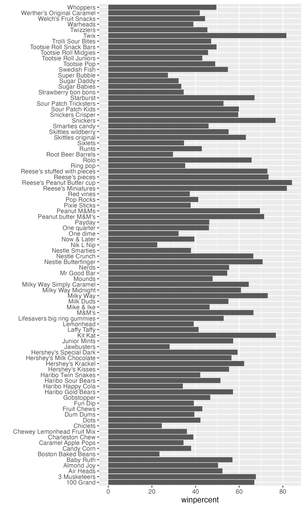
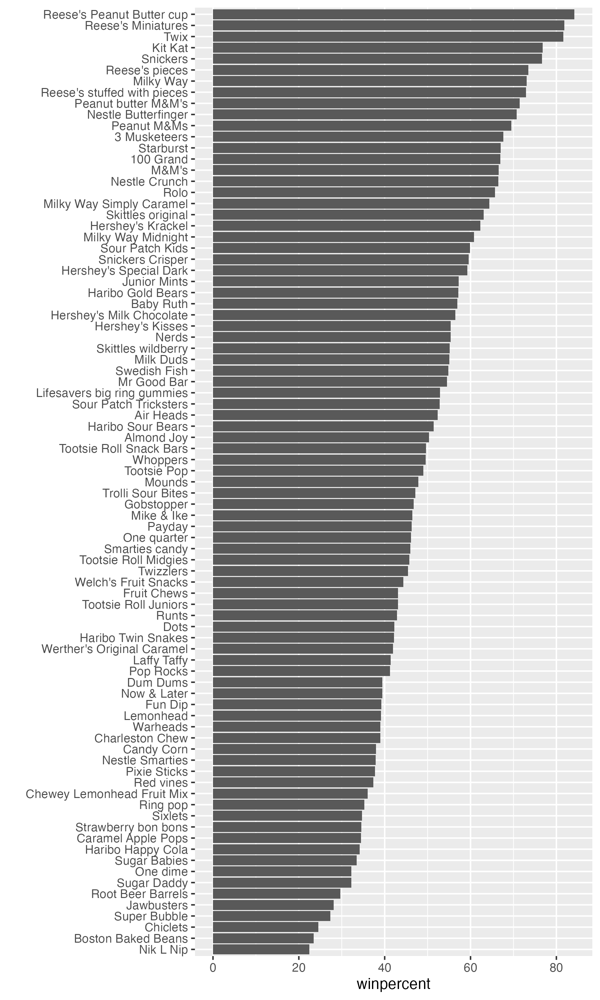
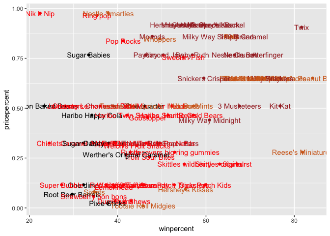
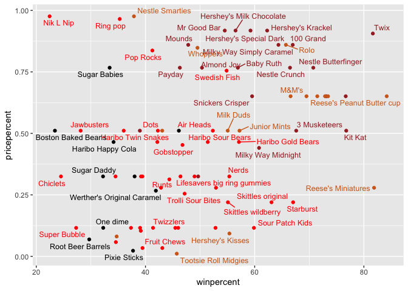
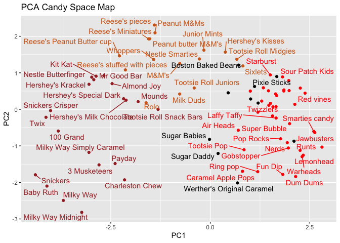
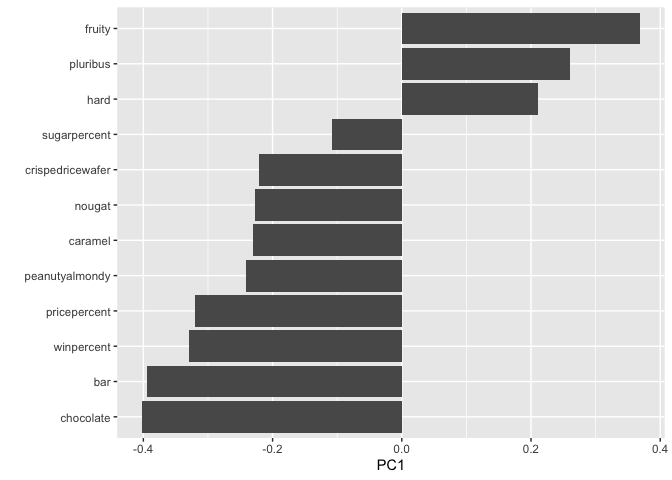

# Class09: Candy Mini Project
Barry (PID: 911)

- [Background](#background)
- [Data Import](#data-import)
- [Exploratory Analysis](#exploratory-analysis)
- [Overall Candy Rankings](#overall-candy-rankings)
- [Time to add some useful color](#time-to-add-some-useful-color)
- [Taking a look at pricepercent](#taking-a-look-at-pricepercent)
- [Exploring the correlation
  structure](#exploring-the-correlation-structure)
- [Principal Component Analysis](#principal-component-analysis)

## Background

In today’s mini-project we will analyze candy data with the exploratory
graphics, basic statistics, correlation analysis and principal component
analysis methods we have been learning thus far.

## Data Import

The data comes as a CSV file from 538.

``` r
candy <- read.csv("candy-data.csv", row.names = 1)
head(candy)
```

                 chocolate fruity caramel peanutyalmondy nougat crispedricewafer
    100 Grand            1      0       1              0      0                1
    3 Musketeers         1      0       0              0      1                0
    One dime             0      0       0              0      0                0
    One quarter          0      0       0              0      0                0
    Air Heads            0      1       0              0      0                0
    Almond Joy           1      0       0              1      0                0
                 hard bar pluribus sugarpercent pricepercent winpercent
    100 Grand       0   1        0        0.732        0.860   66.97173
    3 Musketeers    0   1        0        0.604        0.511   67.60294
    One dime        0   0        0        0.011        0.116   32.26109
    One quarter     0   0        0        0.011        0.511   46.11650
    Air Heads       0   0        0        0.906        0.511   52.34146
    Almond Joy      0   1        0        0.465        0.767   50.34755

> Q1. How many different candy types are in this dataset?

There are 85 rows in this dataset

> Q2. How many fruity candy types are in the dataset?

``` r
sum(candy$fruity)
```

    [1] 38

> Q3. What is your favorite candy (other than Twix) in the dataset and
> what is it’s winpercent value?

``` r
candy["Milky Way", "winpercent"]
```

    [1] 73.09956

> Q4. What is the winpercent value for “Kit Kat”?

> Q5. What is the winpercent value for “Tootsie Roll Snack Bars”?

## Exploratory Analysis

> Q8. Plot a histogram of winpercent values using both base R an
> ggplot2.

``` r
hist( candy$winpercent, breaks=8 )
```


``` r
library(ggplot2)
```

    Warning: package 'ggplot2' was built under R version 4.4.3

``` r
ggplot(candy) +
  aes(winpercent) +
  geom_histogram(bins=12, fill="lightblue", col="darkgray")
```



> Q9. Is the distribution of winpercent values symmetrical?

No

> Q10. Is the center of the distribution above or below 50%?

``` r
mean(candy$winpercent)
```

    [1] 50.31676

``` r
summary(candy$winpercent)
```

       Min. 1st Qu.  Median    Mean 3rd Qu.    Max. 
      22.45   39.14   47.83   50.32   59.86   84.18 

``` r
ggplot(candy) +
  aes(winpercent) +
  geom_boxplot()
```


> Q11. On average is chocolate candy higher or lower ranked than fruit
> candy?

Steps to solve this: 1. Find all chocolate candy in the dataset 2.
Extract or find their winpercent values 3. Calculate the mean of these
values

4.  Find all fruit candy
5.  Find their winpercent values
6.  Calculate their mean value

``` r
choc.candy <- candy[ candy$chocolate==1, ]
choc.win   <- choc.candy$winpercent
mean(choc.win)
```

    [1] 60.92153

``` r
fruit.candy <- candy[ candy$fruity==1, ]
fruit.win   <- fruit.candy$winpercent
mean(fruit.win)
```

    [1] 44.11974

> Q12. Is this difference statistically significant?

``` r
t.test(choc.win, fruit.win)
```


        Welch Two Sample t-test

    data:  choc.win and fruit.win
    t = 6.2582, df = 68.882, p-value = 2.871e-08
    alternative hypothesis: true difference in means is not equal to 0
    95 percent confidence interval:
     11.44563 22.15795
    sample estimates:
    mean of x mean of y 
     60.92153  44.11974 

## Overall Candy Rankings

> Q13. What are the five least liked candy types in this set?

``` r
y <- c("z","c", "a")
sort(y)
```

    [1] "a" "c" "z"

``` r
y
```

    [1] "z" "c" "a"

``` r
order(y)
```

    [1] 3 2 1

``` r
y[ order(y) ]
```

    [1] "a" "c" "z"

``` r
inds <- order(candy$winpercent)
head( candy[inds, ], 5)
```

                       chocolate fruity caramel peanutyalmondy nougat
    Nik L Nip                  0      1       0              0      0
    Boston Baked Beans         0      0       0              1      0
    Chiclets                   0      1       0              0      0
    Super Bubble               0      1       0              0      0
    Jawbusters                 0      1       0              0      0
                       crispedricewafer hard bar pluribus sugarpercent pricepercent
    Nik L Nip                         0    0   0        1        0.197        0.976
    Boston Baked Beans                0    0   0        1        0.313        0.511
    Chiclets                          0    0   0        1        0.046        0.325
    Super Bubble                      0    0   0        0        0.162        0.116
    Jawbusters                        0    1   0        1        0.093        0.511
                       winpercent
    Nik L Nip            22.44534
    Boston Baked Beans   23.41782
    Chiclets             24.52499
    Super Bubble         27.30386
    Jawbusters           28.12744

> Q14. What are the top 5 all time favorite candy types out of this set?

``` r
tail(candy[inds, ], 5)
```

                              chocolate fruity caramel peanutyalmondy nougat
    Snickers                          1      0       1              1      1
    Kit Kat                           1      0       0              0      0
    Twix                              1      0       1              0      0
    Reese's Miniatures                1      0       0              1      0
    Reese's Peanut Butter cup         1      0       0              1      0
                              crispedricewafer hard bar pluribus sugarpercent
    Snickers                                 0    0   1        0        0.546
    Kit Kat                                  1    0   1        0        0.313
    Twix                                     1    0   1        0        0.546
    Reese's Miniatures                       0    0   0        0        0.034
    Reese's Peanut Butter cup                0    0   0        0        0.720
                              pricepercent winpercent
    Snickers                         0.651   76.67378
    Kit Kat                          0.511   76.76860
    Twix                             0.906   81.64291
    Reese's Miniatures               0.279   81.86626
    Reese's Peanut Butter cup        0.651   84.18029

> Q15. Make a first barplot of candy ranking based on winpercent values.

``` r
ggplot(candy) +
  aes(winpercent, rownames(candy)) +
  geom_col() +
  ylab("") # turn off Y-label that we don't need
```


``` r
ggsave("barplot1.png", height=10, width=6)
```



> Q16. This is quite ugly, use the reorder() function to get the bars
> sorted by winpercent?

``` r
ggplot(candy) +
  aes(winpercent, 
      reorder( rownames(candy), winpercent) ) +
  geom_col() +
  ylab("") # turn off Y-label that we don't need
```


``` r
ggsave("barplot2.png", height=10, width=6)
```



## Time to add some useful color

Color by chocolate:

``` r
ggplot(candy) +
  aes(winpercent, 
      reorder( rownames(candy), winpercent),
      fill=chocolate) +
  geom_col() +
  ylab("") 
```


I want custom colors that I pick so we need to make this ourselves…

``` r
my_cols <- rep("black", nrow(candy))
my_cols[candy$chocolate==1] <- "chocolate"
my_cols[candy$bar==1]       <- "brown"
my_cols[candy$fruity==1]    <- "pink"
```

``` r
ggplot(candy) +
  aes(winpercent, 
      reorder( rownames(candy), winpercent) ) +
  geom_col(fill=my_cols) 
```


> Q17. What is the worst ranked chocolate candy?

> Q18. What is the best ranked fruity candy?

## Taking a look at pricepercent

Make a plot of winpercent vs the pricepercent

``` r
my_cols[candy$fruity==1]    <- "red"

ggplot(candy) +
  aes(x=winpercent, y=pricepercent, label=rownames(candy)) +
  geom_point(col=my_cols) +
  geom_text(col=my_cols)
```



We can use the **ggrepel** package for better label placment:

``` r
library(ggrepel)

ggplot(candy) +
  aes(x=winpercent, y=pricepercent, label=rownames(candy)) +
  geom_point(col=my_cols) +
  geom_text_repel(col=my_cols, max.overlaps = 7, size=3.3)
```

    Warning: ggrepel: 27 unlabeled data points (too many overlaps). Consider
    increasing max.overlaps



## Exploring the correlation structure

Pearson correlation values range from -1 to +1

``` r
library(corrplot)
```

    corrplot 0.95 loaded

``` r
cij <- cor(candy)
corrplot(cij)
```


## Principal Component Analysis

``` r
pca <- prcomp(candy, scale=T)
summary(pca)
```

    Importance of components:
                              PC1    PC2    PC3     PC4    PC5     PC6     PC7
    Standard deviation     2.0788 1.1378 1.1092 1.07533 0.9518 0.81923 0.81530
    Proportion of Variance 0.3601 0.1079 0.1025 0.09636 0.0755 0.05593 0.05539
    Cumulative Proportion  0.3601 0.4680 0.5705 0.66688 0.7424 0.79830 0.85369
                               PC8     PC9    PC10    PC11    PC12
    Standard deviation     0.74530 0.67824 0.62349 0.43974 0.39760
    Proportion of Variance 0.04629 0.03833 0.03239 0.01611 0.01317
    Cumulative Proportion  0.89998 0.93832 0.97071 0.98683 1.00000

The main results figure: the PCA score plot:

``` r
p <- ggplot(pca$x) +
  aes(PC1, PC2, label=rownames(pca$x)) +
  geom_point(col=my_cols) +
  geom_text_repel(col=my_cols) +
  labs(title="PCA Candy Space Map")

p
```

    Warning: ggrepel: 24 unlabeled data points (too many overlaps). Consider
    increasing max.overlaps



> Q24. Complete the code to generate the loadings plot above. What
> original variables are picked up strongly by PC1 in the positive
> direction? Do these make sense to you? Where did you see this
> relationship highlighted previously?

The “loadings” plot for PC1

``` r
ggplot(pca$rotation) +
  aes(PC1, 
      reorder( rownames(pca$rotation), PC1) ) +
  geom_col() +
  ylab("")
```



``` r
#library(plotly)
#ggplotly(p)
```

> Q25. Based on your exploratory analysis, correlation findings, and PCA
> results, what combination of characteristics appears to make a
> “winning” candy? How do these different analyses (visualization,
> correlation, PCA) support or complement each other in reaching this
> conclusion?
