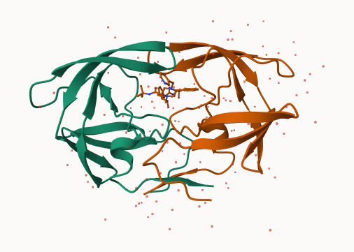
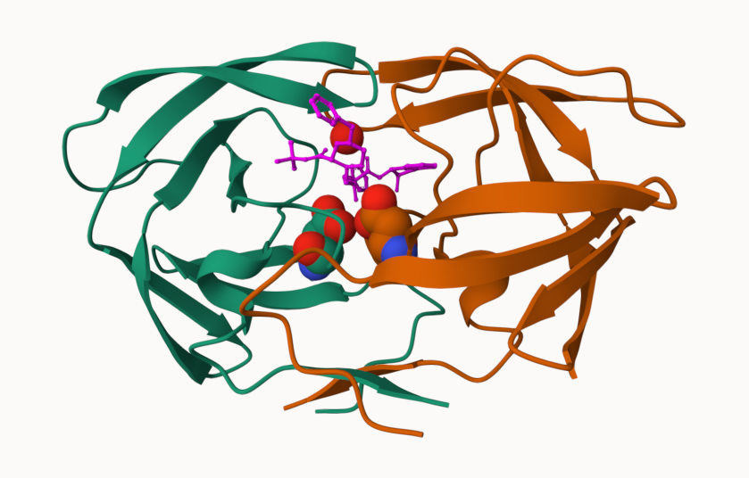

## The PDB database

The main database for structural biology is called the PDB (Protein Data Bank). Let's have a look at what it contains:

Download a CSV file from the PDB site (accessible from “Analyze” > “PDB Statistics” > “by Experimental Method and Molecular Type”. 


```{r pdbstats, message=FALSE}
library(readr)

stats <- read_csv("Data Export Summary.csv")
stats
```

```{r}
n.total <- sum(stats$Total)
n.total
```

> Q1: What percentage of structures in the PDB are solved by X-Ray and Electron Microscopy. Give your answers to 2 significant figures.

```{r}
n.xray <- sum(stats$`X-ray`) 
precent.xray <- n.xray / n.total * 100
precent.xray
```
There are `r round(precent.xray, 2)` percent Xray structures in the PDB


> Q2: What proportion of structures in the PDB are protein?

```{r}
round( stats$Total[1]/n.total * 100, 2)
```


```{r}
library(ggplot2)

ggplot(stats) +
  aes(`Molecular Type`, Total) +
  geom_col()
```

```{r}
library(tidyr)  # for pivot_longer
library(dplyr)  # for data manipulation

# Reshape data from wide to long format
stats_long <- stats |>
  pivot_longer(
    cols = -`Molecular Type`,  # Everything except Molecular Type
    names_to = "Method",
    values_to = "Count"
  )

```

Now we can plot a stacked barplot
```{r}
ggplot(stats_long) +
  aes(x = reorder(`Molecular Type`, -Count), #`Molecular Type`, 
      y = Count, fill = Method) +
  geom_col() +  # This automatically stacks when fill is mapped
  labs(
    title = "PDB Database Composition Oct 2025",
    x = "",
    y = "Number of Structures",
    fill = "Experimental Method"
  ) +
  theme_minimal() +
  theme(
    axis.text.x = element_text(angle = 45, hjust = 1),
    plot.title = element_text(size = 14, face = "bold", hjust = 0.5)
  ) +
  scale_y_continuous(labels = scales::comma) + # Add comma separators
  # Add total labels at the top
  geom_text(data = stats, 
            aes(x = `Molecular Type`, y = Total, label = scales::comma(Total)),
            inherit.aes = FALSE,
            vjust = -0.5,  # Position above the bar
            size = 3.5) 
```

The key insight is that ggplot2 needs data in "long" format where each row represents one observation (molecular type + method + count), rather than "wide" format where methods are spread across columns.


## Exploring PDB structures

Package for structural bioinformatics

```{r}
library(bio3d)

hiv <- read.pdb("1hsg")
hiv
```

Let's first use the Mol* viewer to explore this structure.



And a view of the ligand (ball and stick) with catalytic ASP 25 amino-acids (spacefill) and the all important active site water molecule (spacefill):




## PDB objects in R

```{r}
head( hiv$atom )
```
Extract the sequence
```{r}
pdbseq(hiv)
```

```{r}
chainA_seq <- pdbseq( trim.pdb(hiv, chain="A") )
```

I can interactively view these PDB objects in R with the new **bio3dview** package. This is not yet on CRAN.

To install this I can setup **pak** package and use it to install **bio3dview** from GitHub. In my console I first run

install.packages("pak")
pak::pak("bioboot/bio3dview")

```{r}
library(bio3dview)

view.pdb(hiv)
```

Change some settings

```{r}
sel <- atom.select(hiv, resno=25)

view.pdb(hiv, highlight = sel,
         highlight.style = "spacefill",
         colorScheme = "chain", 
         col=c("blue","orange"),
         backgroundColor = "pink")
```

## Predict protein flexiblity

We can run a bioinformatics calculation to predict protein dynamics - i.e. functional motions.

We will use the `nma()` function:

```{r}
adk <- read.pdb("6s36")
adk
```

```{r}
m <- nma(adk)
plot(m)
```

Generate a "trajectory" of predicted motion
```{r}
mktrj(m, file="ADK_nma.pdb")
```

```{r}
view.nma(m)
```


```{r}
#' Read a PDBx/mmCIF file (including gz) into category data.frames
#'
#' @param file Path or connection. .gz supported.
#' @param all_blocks If TRUE, return a named list of data blocks; otherwise first block.
#' @param na_symbols Character vector treated as NA (default c(".", "?")).
#' @param infer_types Try to convert numeric-like columns to numeric/integer.
#' @param keep_raw If TRUE, include raw lines and token stream for debugging.
#' @return A named list with one element per category (data.frame). Also
#'         attributes: data_block (name), items (scalar items), and optionally raw.
#'         If all_blocks=TRUE, returns a list of such objects keyed by data_ name.
#' @examples
#' # x <- read_mmcif("1crn.cif.gz")
#' # names(x)            # categories like "atom_site", "entity", ...
#' # head(x$atom_site)
read_mmcif <- function(file,
                       all_blocks = FALSE,
                       na_symbols = c(".", "?"),
                       infer_types = TRUE,
                       keep_raw = FALSE) {

  # ----- I/O helpers ----------------------------------------------------------
  open_conn <- function(f) {
    if (inherits(f, "connection")) return(f)
    if (is.character(f) && grepl("\\.gz$", f, ignore.case = TRUE)) {
      con <- gzfile(f, open = "rt")
    } else {
      con <- file(f, open = "rt")
    }
    con
  }
  on.exit({
    if (exists("con", inherits = FALSE) && isOpen(con)) try(close(con), silent = TRUE)
  }, add = TRUE)

  con <- open_conn(file)
  lines <- readLines(con, warn = FALSE)
  if (keep_raw) raw_lines <- lines

  # Normalize: ensure trailing newline behavior for semicolon text parsing
  lines <- c(lines, "")  # sentinel

  # ----- Tokenizer with semicolon and quotes ----------------------------------
  # Produces a flat token stream per data block; we’ll parse structurally.
  tokenize_block <- function(block_lines) {
    tokens <- character()
    i <- 1L; n <- length(block_lines)

    # helper: append tokens
    push <- function(x) tokens <<- c(tokens, x)

    while (i <= n) {
      line <- block_lines[i]

      # drop comments starting with '#'
      if (startsWith(line, "#")) { i <- i + 1L; next }

      # blank lines → skip
      if (!nzchar(trimws(line))) { i <- i + 1L; next }

      # Semicolon text field: must begin at column 1 with ';'
      if (substr(line, 1L, 1L) == ";" ) {
        i <- i + 1L
        txt <- character()
        while (i <= n && substr(block_lines[i], 1L, 1L) != ";") {
          txt <- c(txt, block_lines[i])
          i <- i + 1L
        }
        # End should be a line with single ';'
        push(paste(txt, collapse = "\n"))
        i <- i + 1L
        next
      }

      # Otherwise we need to split into CIF atoms/tokens.
      # Rules: tokens are separated by whitespace unless in single/double quotes.
      # We also keep leading directives like data_, loop_, save_, stop_
      # and item names starting with '_' as separate tokens.
      j <- 1L; L <- nchar(line)
      while (j <= L) {
        # skip whitespace
        while (j <= L && grepl("\\s", substr(line, j, j))) j <- j + 1L
        if (j > L) break

        ch <- substr(line, j, j)

        # Handle quoted tokens
        if (ch %in% c("'", "\"")) {
          q <- ch
          j <- j + 1L
          start <- j
          buf <- character()
          while (j <= L) {
            cch <- substr(line, j, j)
            if (cch == q) {
              # quote ends; token is inside quotes
              push(substr(line, start, j - 1L))
              j <- j + 1L
              break
            } else {
              j <- j + 1L
            }
          }
          if (j > L + 1L) {
            # unmatched quote—fall back to rest of line
            push(substr(line, start, L))
          }
          next
        }

        # Unquoted token: read until whitespace
        start <- j
        while (j <= L && !grepl("\\s", substr(line, j, j))) j <- j + 1L
        push(substr(line, start, j - 1L))
      }

      i <- i + 1L
    }
    tokens
  }

  # ----- Split into data_ blocks ----------------------------------------------
  # Find indices of lines that begin with data_ (col 1)
  data_starts <- grep("^data_[^\\s]*\\s*$|^data_[^\\s]*", lines)
  if (!length(data_starts)) stop("No data_ block found in file.")

  # Add sentinel for last block end
  blk_bounds <- mapply(function(s, e) c(start = s, end = e),
                       s = data_starts,
                       e = c(data_starts[-1] - 1L, length(lines)),
                       SIMPLIFY = FALSE)

  parse_one_block <- function(start, end) {
    # Extract block name from the data_ line
    header <- lines[start]
    block_name <- sub("^data_\\s*", "", header)
    block_name <- trimws(block_name)

    # Tokenize everything after the data_ line up to end
    block_tokens <- tokenize_block(lines[(start + 1L):end])

    # Parser state
    pos <- 1L; Tn <- length(block_tokens)
    categories <- list()
    items_scalar <- list()

    at_end <- function() pos > Tn
    peek <- function() if (!at_end()) block_tokens[pos] else NULL
    next_tok <- function() { t <- peek(); pos <<- pos + 1L; t }
    is_directive <- function(t) !is.null(t) && grepl("^(loop_|save_|stop_|data_)", t)
    is_item <- function(t) !is.null(t) && startsWith(t, "_")

    # value parsing: apply NA map and type inference later
    normalize_value <- function(v) {
      if (is.null(v)) return(NA_character_)
      v <- trimws(v, which = "both")
      if (v %in% na_symbols) return(NA_character_)
      v
    }

    # Read a single key-value item: _cat.item  value
    parse_item <- function(tag) {
      val <- next_tok()
      if (is.null(val)) val <- NA_character_
      val <- normalize_value(val)
      # place into categories by split of tag
      pieces <- strsplit(sub("^_", "", tag), "\\.", fixed = TRUE)[[1]]
      cat <- pieces[1]; key <- pieces[2]
      if (is.null(categories[[cat]]) || !is.data.frame(categories[[cat]])) {
        # store scalar items in a named list first; we’ll coerce to data.frame later
        if (is.null(items_scalar[[cat]])) items_scalar[[cat]] <<- list()
        items_scalar[[cat]][[key]] <<- val
      } else {
        # if a table already exists, append a 1-row df with missing cols filled
        df <- categories[[cat]]
        row <- as.list(rep(NA_character_, ncol(df))); names(row) <- names(df)
        if (key %in% names(df)) row[[key]] <- val
        categories[[cat]] <<- rbind(df, as.data.frame(row, check.names = FALSE))
      }
    }

    # Parse a loop_ construct
    parse_loop <- function() {
      # tags come first (one per token/line) until a non-item token
      tags <- character()
      while (!at_end() && is_item(peek())) tags <- c(tags, next_tok())
      if (!length(tags)) return(invisible(NULL))

      # Values follow, flattened. We need to read until a directive or new item
      # BUT values can include semicolon text tokens (handled by tokenizer)
      vals <- character()
      while (!at_end()) {
        t <- peek()
        # loop ends when we see a new item tag, loop_, save_, stop_, or data_
        if (is_directive(t) || is_item(t)) break
        vals <- c(vals, next_tok())
      }
      # normalize
      vals <- vapply(vals, normalize_value, character(1))

      # Determine categories involved
      tag_parts <- strsplit(sub("^_", "", tags), "\\.")
      cats <- vapply(tag_parts, `[`, character(1), 1L)
      keys <- vapply(tag_parts, `[`, character(1), 2L)
      unique_cats <- unique(cats)

      # Some (rare) mmCIF loops span multiple categories—split per category if so
      for (cat in unique_cats) {
        idx <- which(cats == cat)
        cat_keys <- keys[idx]
        width <- length(idx)

        # Pull the appropriate slice of the flattened values for this category.
        # If the loop mixes categories, we take only positions corresponding to this cat.
        if (length(unique_cats) == 1L) {
          # Simple: chunk by width
          nrow_est <- floor(length(vals) / width)
          if (nrow_est * width != length(vals)) {
            # tolerant: drop trailing partial row
            ok_len <- nrow_est * width
            vals_cat <- vals[seq_len(ok_len)]
          } else {
            vals_cat <- vals
          }
          mat <- matrix(vals_cat, ncol = width, byrow = TRUE)
        } else {
          # Interleaved mixture: select every full row in global loop, then subset columns
          width_all <- length(tags)
          nrow_est <- floor(length(vals) / width_all)
          ok_len <- nrow_est * width_all
          if (ok_len == 0L) next
          M <- matrix(vals[seq_len(ok_len)], ncol = width_all, byrow = TRUE)
          mat <- M[, idx, drop = FALSE]
        }

        df <- as.data.frame(mat, stringsAsFactors = FALSE, check.names = FALSE)
        names(df) <- cat_keys

        # Type inference (numeric/integer) if requested
        if (infer_types && nrow(df)) {
          df <- .infer_types_df(df)
        }

        if (!is.null(categories[[cat]])) {
          categories[[cat]] <- rbind_fill(categories[[cat]], df)
        } else {
          categories[[cat]] <- df
        }
      }
      invisible(NULL)
    }

    # rbind with column union
    rbind_fill <- function(x, y) {
      cx <- names(x); cy <- names(y)
      add_to_x <- setdiff(cy, cx)
      add_to_y <- setdiff(cx, cy)
      if (length(add_to_x)) x[add_to_x] <- NA
      if (length(add_to_y)) y[add_to_y] <- NA
      x <- x[, sort(names(x)), drop = FALSE]
      y <- y[, sort(names(y)), drop = FALSE]
      rbind(x, y)
    }

    # simple type inference for data.frame of characters
    .infer_types_df <- function(df) {
      for (k in names(df)) {
        v <- df[[k]]
        if (!length(v)) next
        if (!is.character(v)) next
        # numeric?
        suppressWarnings(num <- as.numeric(v))
        if (sum(!is.na(v)) && sum(!is.na(num)) == sum(!is.na(v))) {
          # all non-NA values numeric; maybe integer?
          if (all(abs(num - round(num)) < .Machine$double.eps^0.5, na.rm = TRUE)) {
            df[[k]] <- as.integer(num)
          } else {
            df[[k]] <- num
          }
        }
      }
      df
    }

    # Main parse loop
    while (!at_end()) {
      t <- next_tok()
      if (is.null(t)) break
      if (t == "loop_") {
        parse_loop(); next
      }
      if (grepl("^save_", t)) {
        # Enter/exit save frames transparently: consume until matching save_
        # Save frames are rare in PDBx; we’ll skip their content into the main stream.
        # If needed, you can add a nested scope here.
        next
      }
      if (startsWith(t, "_")) {
        parse_item(t); next
      }
      # Any other tokens (including stray words) are ignored.
    }

    # Coerce scalar items into 1-row data.frames per category (merge if table exists)
    if (length(items_scalar)) {
      for (cat in names(items_scalar)) {
        scal <- items_scalar[[cat]]
        df1 <- as.data.frame(as.list(scal), check.names = FALSE, stringsAsFactors = FALSE)
        if (infer_types) df1 <- .infer_types_df(df1)
        if (is.null(categories[[cat]])) {
          categories[[cat]] <- df1
        } else {
          categories[[cat]] <- rbind_fill(categories[[cat]], df1)
        }
      }
    }

    out <- categories
    attr(out, "data_block") <- block_name
    attr(out, "items") <- items_scalar
    if (keep_raw) attr(out, "raw") <- list(lines = raw_lines, tokens = block_tokens)
    out
  }

  blocks <- lapply(blk_bounds, function(b) parse_one_block(b["start"], b["end"]))
  names(blocks) <- vapply(blocks, function(x) attr(x, "data_block"), character(1))

  if (all_blocks) return(blocks)
  blocks[[1L]]
}
```

```{r}
f <- "https://files.rcsb.org/view/5P21.cif"

x <- read_mmcif(f)
```

```{r}
source("~/Downloads/mmCif_files/read.mmcif.R")
source("~/Downloads/mmCif_files/mmcif_utils.R")
```

```{r}
mmcif <- read.mmcif("https://files.rcsb.org/download/5p21.cif")
```

```{r}
mmcif$atoms
```

```{r}
colnames(mmcif$atoms)
```

_atom_site.group_PDB
_atom_site.id
_atom_site.type_symbol
_atom_site.label_atom_id
_atom_site.label_alt_id
_atom_site.label_comp_id
_atom_site.label_asym_id
_atom_site.label_entity_id
_atom_site.label_seq_id
_atom_site.pdbx_PDB_ins_code
_atom_site.Cartn_x
_atom_site.Cartn_y
_atom_site.Cartn_z
_atom_site.occupancy
_atom_site.B_iso_or_equiv
_atom_site.pdbx_formal_charge
_atom_site.auth_seq_id
_atom_site.auth_comp_id
_atom_site.auth_asym_id
_atom_site.auth_atom_id
_atom_site.pdbx_PDB_model_num


 [1,] "type"   record     group_PDB
 [2,] "eleno"  atom_id.   id.      (type_symbol missing is basciacly element! N C etc)
 [3,] "elety"  atom_name  label_atom_id
 [4,] "alt"    alt_loc    label_alt_id
 [5,] "resid"  comp_id    label_comp_id
 [6,] "chain"  chain_id   label_asym_id ("label_entity_id" missing is basicaly chain number!)
 [7,] "resno"  seq_id     label_seq_id
 [8,] "insert"            pdbx_PDB_ins_code
 [9,] "x"      x          Cartn_x
[10,] "y"      y          Cartn_y
[11,] "z"      z          Cartn_z
[12,] "o"      occupancy  occupancy
[13,] "b"      b_factor   B_iso_or_equiv  [After this is not needed really!]
[14,] "segid"             pdbx_PDB_model_num *
[15,] "elesy"  element.   auth_atom_id 
[16,] "charge"            pdbx_formal_charge *


```{r}
source("~/Downloads/mmCif_v2_files/read.mmcif.R")
source("~/Downloads/mmCif_v2_files/mmcif_utils.R")
```


```{r}
mmcif <- read.mmcif("https://files.rcsb.org/download/5p21.cif")
head(mmcif$atom)
```

```{r}
# Need an ATOM.only = TRUE option
file <- f
maxlines <- -1
ATOM.only <- TRUE
lines <- readLines(file, n = maxlines)

#atom.line.inds <- grep("_atom_site", lines)
atom.line.inds <- grep("_atom_site.group_PDB", lines)
atom.site.inds <- grep("_atom_site.", lines)
atom.site.inds <- atom.site.inds[atom.site.inds > atom.line.inds]
hash.line.inds <- grep("#",lines)
post.atom.hash <- hash.line.inds[hash.line.inds > atom.line.inds][1]

# Or just find the lines that start with ATOM!! and HETATM!!!

  ##- Shortened records if ATOM.only = TRUE
  if(ATOM.only) {
     #raw.lines <- raw.lines[type %in% c("HEADER", "ATOM  ", "HETATM")]
     #type <- substring(raw.lines, first["type"], last["type"])
    atom.lines <- lines[grep("^ATOM", lines)]
    het.lines <- lines[grep("^HETATM", lines)]
  }

lines[atom.site.inds]


df <- as.data.frame(do.call(rbind, strsplit(atom.lines, "\\s+")))
cif.names <- c("type", gsub("_atom_site.","", lines[atom.site.inds]))
names(df) <- cif.names
  
# Type inference: convert numeric-looking columns to numeric
df[] <- lapply(df, function(col) {
  suppressWarnings(num <- as.numeric(col))
  if (all(!is.na(num) | col == "")) num else col
})
```

