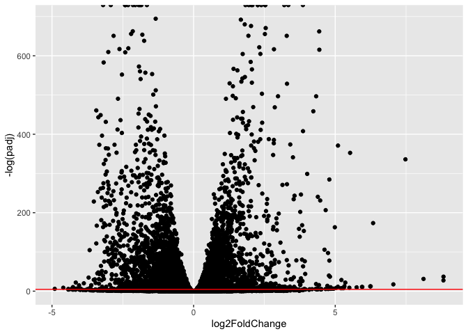
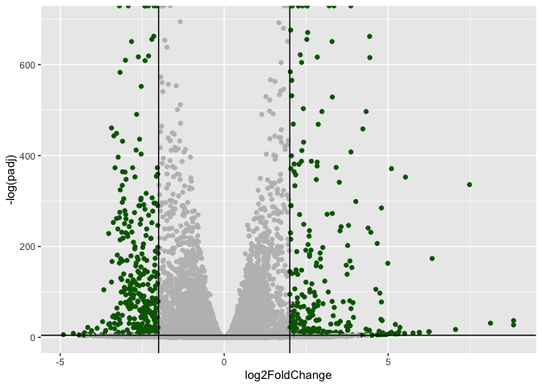

# Class 14: RNASeq Mini-Project
Barry (PID: 911)

## Background

The data for today’s mini-project comes from a knock-down study of an
important HOX gene.

## Data Import

``` r
countData <- read.csv("GSE37704_featurecounts.csv", row.names = 1)
colData <-  read.csv("GSE37704_metadata.csv", row.names = 1)
```

Have a wee peak at these:

``` r
colData
```

                  condition
    SRR493366 control_sirna
    SRR493367 control_sirna
    SRR493368 control_sirna
    SRR493369      hoxa1_kd
    SRR493370      hoxa1_kd
    SRR493371      hoxa1_kd

``` r
head(countData)
```

                    length SRR493366 SRR493367 SRR493368 SRR493369 SRR493370
    ENSG00000186092    918         0         0         0         0         0
    ENSG00000279928    718         0         0         0         0         0
    ENSG00000279457   1982        23        28        29        29        28
    ENSG00000278566    939         0         0         0         0         0
    ENSG00000273547    939         0         0         0         0         0
    ENSG00000187634   3214       124       123       205       207       212
                    SRR493371
    ENSG00000186092         0
    ENSG00000279928         0
    ENSG00000279457        46
    ENSG00000278566         0
    ENSG00000273547         0
    ENSG00000187634       258

### Clean up (data tidying)

We need to remove the funny “length” column from our `countData` to make
the columns match the rows in `colData`.

``` r
countData <- countData[,-1]
```

Check match of `colData` and `countData`

``` r
rownames(colData) == colnames(countData)
```

    [1] TRUE TRUE TRUE TRUE TRUE TRUE

``` r
head(countData)
```

                    SRR493366 SRR493367 SRR493368 SRR493369 SRR493370 SRR493371
    ENSG00000186092         0         0         0         0         0         0
    ENSG00000279928         0         0         0         0         0         0
    ENSG00000279457        23        28        29        29        28        46
    ENSG00000278566         0         0         0         0         0         0
    ENSG00000273547         0         0         0         0         0         0
    ENSG00000187634       124       123       205       207       212       258

### Remove zero count genes

``` r
to.keep <- rowSums(countData) > 0
countData <- countData[to.keep,]
```

## DESeq Analysis

``` r
library(DESeq2)
```

### Setting up the DESeq object

``` r
dds <- DESeqDataSetFromMatrix(countData = countData,
                       colData = colData,
                       design = ~condition)
```

    Warning in DESeqDataSet(se, design = design, ignoreRank): some variables in
    design formula are characters, converting to factors

### Running DESeq

``` r
dds <- DESeq(dds)
```

    estimating size factors

    estimating dispersions

    gene-wise dispersion estimates

    mean-dispersion relationship

    final dispersion estimates

    fitting model and testing

### Getting results

``` r
res <- results(dds)
head(res)
```

    log2 fold change (MLE): condition hoxa1 kd vs control sirna 
    Wald test p-value: condition hoxa1 kd vs control sirna 
    DataFrame with 6 rows and 6 columns
                     baseMean log2FoldChange     lfcSE       stat      pvalue
                    <numeric>      <numeric> <numeric>  <numeric>   <numeric>
    ENSG00000279457   29.9136      0.1792571 0.3248216   0.551863 5.81042e-01
    ENSG00000187634  183.2296      0.4264571 0.1402658   3.040350 2.36304e-03
    ENSG00000188976 1651.1881     -0.6927205 0.0548465 -12.630158 1.43989e-36
    ENSG00000187961  209.6379      0.7297556 0.1318599   5.534326 3.12428e-08
    ENSG00000187583   47.2551      0.0405765 0.2718928   0.149237 8.81366e-01
    ENSG00000187642   11.9798      0.5428105 0.5215599   1.040744 2.97994e-01
                           padj
                      <numeric>
    ENSG00000279457 6.86555e-01
    ENSG00000187634 5.15718e-03
    ENSG00000188976 1.76549e-35
    ENSG00000187961 1.13413e-07
    ENSG00000187583 9.19031e-01
    ENSG00000187642 4.03379e-01

## Volcano Plot

A plot of log2 fold change vs -log of Adjusted P-value.

``` r
library(ggplot2)
```

    Warning: package 'ggplot2' was built under R version 4.4.3

``` r
ggplot(res) +
  aes(log2FoldChange,
      -log(padj)) +
  geom_point() +
  geom_hline(yintercept = -log(0.01), col="red")
```

    Warning: Removed 1237 rows containing missing values or values outside the scale range
    (`geom_point()`).



### Add some color

``` r
mycols <- rep("gray", nrow(res))
mycols[ abs(res$log2FoldChange) > 2 ] <- "darkgreen"
mycols[ res$padj >= 0.01 ] <- "gray"

ggplot(res) +
  aes(log2FoldChange,
      -log(padj)) +
  geom_point(col=mycols) +
  geom_vline(xintercept = c(-2,2) ) +
  geom_hline(yintercept = -log(0.01))
```

    Warning: Removed 1237 rows containing missing values or values outside the scale range
    (`geom_point()`).



## Add Annotation

``` r
library(AnnotationDbi)
library(org.Hs.eg.db)
```

``` r
columns(org.Hs.eg.db)
```

     [1] "ACCNUM"       "ALIAS"        "ENSEMBL"      "ENSEMBLPROT"  "ENSEMBLTRANS"
     [6] "ENTREZID"     "ENZYME"       "EVIDENCE"     "EVIDENCEALL"  "GENENAME"    
    [11] "GENETYPE"     "GO"           "GOALL"        "IPI"          "MAP"         
    [16] "OMIM"         "ONTOLOGY"     "ONTOLOGYALL"  "PATH"         "PFAM"        
    [21] "PMID"         "PROSITE"      "REFSEQ"       "SYMBOL"       "UCSCKG"      
    [26] "UNIPROT"     

``` r
res$symbol <- mapIds(org.Hs.eg.db,
                     keys=rownames(res),
                     keytype = "ENSEMBL",
                     column="SYMBOL")
```

    'select()' returned 1:many mapping between keys and columns

``` r
res$entrez <- mapIds(org.Hs.eg.db,
                     keys=rownames(res),
                     keytype = "ENSEMBL",
                     column="ENTREZID")
```

    'select()' returned 1:many mapping between keys and columns

``` r
head(res)
```

    log2 fold change (MLE): condition hoxa1 kd vs control sirna 
    Wald test p-value: condition hoxa1 kd vs control sirna 
    DataFrame with 6 rows and 8 columns
                     baseMean log2FoldChange     lfcSE       stat      pvalue
                    <numeric>      <numeric> <numeric>  <numeric>   <numeric>
    ENSG00000279457   29.9136      0.1792571 0.3248216   0.551863 5.81042e-01
    ENSG00000187634  183.2296      0.4264571 0.1402658   3.040350 2.36304e-03
    ENSG00000188976 1651.1881     -0.6927205 0.0548465 -12.630158 1.43989e-36
    ENSG00000187961  209.6379      0.7297556 0.1318599   5.534326 3.12428e-08
    ENSG00000187583   47.2551      0.0405765 0.2718928   0.149237 8.81366e-01
    ENSG00000187642   11.9798      0.5428105 0.5215599   1.040744 2.97994e-01
                           padj      symbol      entrez
                      <numeric> <character> <character>
    ENSG00000279457 6.86555e-01          NA          NA
    ENSG00000187634 5.15718e-03      SAMD11      148398
    ENSG00000188976 1.76549e-35       NOC2L       26155
    ENSG00000187961 1.13413e-07      KLHL17      339451
    ENSG00000187583 9.19031e-01     PLEKHN1       84069
    ENSG00000187642 4.03379e-01       PERM1       84808

## Pathway Analysis

``` r
library(gage)
library(gageData)
library(pathview)
```

We need a foldchanges vector for `gage()`

``` r
foldchanges <- res$log2FoldChange
names(foldchanges) <- res$entrez
```

### KEGG

``` r
data(kegg.sets.hs)
data(sigmet.idx.hs)

# Focus on signaling and metabolic pathways only
kegg.sets.hs = kegg.sets.hs[sigmet.idx.hs]
```

``` r
keggres = gage(foldchanges, gsets=kegg.sets.hs)
```

``` r
head(keggres$less, 4)
```

                                         p.geomean stat.mean        p.val
    hsa04110 Cell cycle               8.995727e-06 -4.378644 8.995727e-06
    hsa03030 DNA replication          9.424076e-05 -3.951803 9.424076e-05
    hsa03013 RNA transport            1.246882e-03 -3.059466 1.246882e-03
    hsa03440 Homologous recombination 3.066756e-03 -2.852899 3.066756e-03
                                            q.val set.size         exp1
    hsa04110 Cell cycle               0.001448312      121 8.995727e-06
    hsa03030 DNA replication          0.007586381       36 9.424076e-05
    hsa03013 RNA transport            0.066915974      144 1.246882e-03
    hsa03440 Homologous recombination 0.121861535       28 3.066756e-03

``` r
pathview(gene.data=foldchanges, pathway.id="hsa04110")
```

    'select()' returned 1:1 mapping between keys and columns

    Info: Working in directory /Users/barry/Desktop/courses/BIMM143/bimm143_github/class14

    Info: Writing image file hsa04110.pathview.png


### GO

``` r
data(go.sets.hs)
data(go.subs.hs)

# Focus on Biological Process subset of GO
gobpsets = go.sets.hs[go.subs.hs$BP]

gobpres = gage(foldchanges, gsets=gobpsets)
```

``` r
head(gobpres$less)
```

                                                p.geomean stat.mean        p.val
    GO:0048285 organelle fission             1.536227e-15 -8.063910 1.536227e-15
    GO:0000280 nuclear division              4.286961e-15 -7.939217 4.286961e-15
    GO:0007067 mitosis                       4.286961e-15 -7.939217 4.286961e-15
    GO:0000087 M phase of mitotic cell cycle 1.169934e-14 -7.797496 1.169934e-14
    GO:0007059 chromosome segregation        2.028624e-11 -6.878340 2.028624e-11
    GO:0000236 mitotic prometaphase          1.729553e-10 -6.695966 1.729553e-10
                                                    q.val set.size         exp1
    GO:0048285 organelle fission             5.841698e-12      376 1.536227e-15
    GO:0000280 nuclear division              5.841698e-12      352 4.286961e-15
    GO:0007067 mitosis                       5.841698e-12      352 4.286961e-15
    GO:0000087 M phase of mitotic cell cycle 1.195672e-11      362 1.169934e-14
    GO:0007059 chromosome segregation        1.658603e-08      142 2.028624e-11
    GO:0000236 mitotic prometaphase          1.178402e-07       84 1.729553e-10

### Reactome

``` r
sig_genes <- res[res$padj <= 0.05 & !is.na(res$padj), "symbol"]
write.table(sig_genes, file="significant_genes.txt", row.names=FALSE, col.names=FALSE, quote=FALSE)
```
