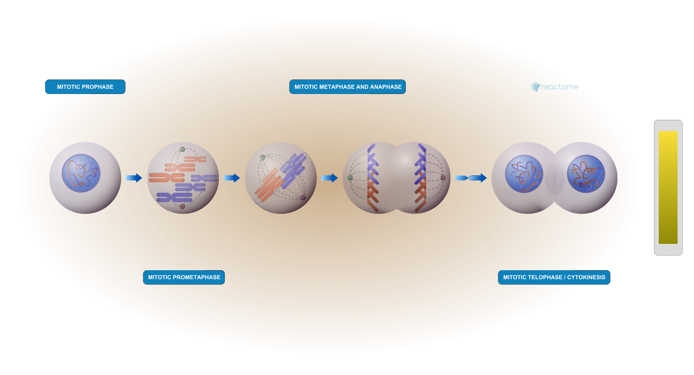

## Background

In today's mini project we will analyze data from GEO entry: GSE37704, which is associated with the following publication:

> Trapnell C, Hendrickson DG, Sauvageau M, Goff L et al. "Differential analysis of gene regulation at transcript resolution with RNA-seq". Nat Biotechnol 2013 Jan;31(1):46-53. PMID: 23222703

The authors report on differential analysis of lung fibroblasts in response to loss of the developmental transcription factor HOXA1. 


## Data Import
Read counts and metadata CSV files

```{r import}
counts <- read.csv("GSE37704_featurecounts.csv", row.names = 1)
metadata <- read.csv("GSE37704_metadata.csv")
```

### Sannity check 

```{r}
metadata
```

```{r}
head(counts)
```

> Q. Complete the code below to remove the troublesome first column from countData

```{r}
countData <- counts[,-1]
head(countData)
```

```{r}
colnames(countData)
```
```{r}
metadata$id
```
```{r}
all( colnames(countData) == metadata$id )
```


> Q. Complete the code below to filter countData to exclude genes (i.e. rows) where we have 0 read count across all samples (i.e. columns).

Tip: We can sum across the rows (i.e. for each gene) and if the answer is zero then we have zero counts for that gene in all experiments...

```{r}
to.keep <- rowSums(countData) != 0
countData <- countData[to.keep,]
```

```{r}
head(countData)
```

```{r}
dim(countData)
```


## Setup DESeq object

```{r, message=FALSE}
library(DESeq2)
```

```{r}
dds <- DESeqDataSetFromMatrix(countData = countData,
                              colData = metadata,
                              design = ~condition)
```


## Run DESeq analysis pipeline

```{r}
dds <- DESeq(dds)
```


## Extract the results
Big table with log2 fold changes and p-values

```{r}
res <- results(dds)
```


```{r}
head(res)
```


## Data Viz
Volcano Plot

```{r}
library(ggplot2)

ggplot(res) +
  aes(log2FoldChange, -log(padj)) +
  geom_point()
```

Add some color and threshold annotation to this plot

```{r}
mycols <- rep("gray", nrow(res))
mycols[ abs(res$log2FoldChange) > 2 ] <- "blue"
mycols[ res$padj > 0.05 ] <- "gray"
```


```{r}
ggplot(res) +
  aes(log2FoldChange, -log(padj)) +
  geom_point(col=mycols) +
  geom_vline(xintercept = c(-2,+2), col="red") +
  geom_hline(yintercept = -log(0.05), col="red")

```


## Add Annotation data
Add gene symbol and entrez ids

```{r}
library(AnnotationDbi)
library(org.Hs.eg.db)

columns(org.Hs.eg.db)

```

```{r}
res$symbol <- mapIds(org.Hs.eg.db,
                     key=rownames(res),
                     keytype = "ENSEMBL",
                     column = "SYMBOL")
```
```{r}
res$entrez <- mapIds(org.Hs.eg.db,
                     key=rownames(res),
                     keytype = "ENSEMBL",
                     column = "ENTREZID")
```

```{r}
head(res)
```


## Pathway analysis
KEGG, GO and REACTOME 

### KEGG

```{r, message=FALSE}
library(pathview)
library(gage)
library(gageData)

data(kegg.sets.hs)
data(sigmet.idx.hs)

# Focus on signaling and metabolic pathways only
kegg.sets.hs = kegg.sets.hs[sigmet.idx.hs]
```

Our input vector of importance
```{r}
foldchanges = res$log2FoldChange
names(foldchanges) = res$entrez

```

```{r}
keggres = gage(foldchanges, gsets=kegg.sets.hs)
```


```{r}
head(keggres$less)
```

```{r}
pathview(gene.data=foldchanges, pathway.id="hsa04110")
```


### Gene Ontology (GO)

```{r}
data(go.sets.hs)
data(go.subs.hs)

# Focus on Biological Process subset of GO
gobpsets = go.sets.hs[go.subs.hs$BP]

gobpres = gage(foldchanges, gsets=gobpsets)
head(gobpres$less)
```

### REACTOME

There is an R package for this analysis and a new-ish website  https://reactome.org/ 

To use the website you can paste or upload a list of your DEGs

```{r}
sig_genes <- res[res$padj <= 0.05 & !is.na(res$padj), "symbol"]
write.table(sig_genes, file="significant_genes.txt", 
            row.names=FALSE, col.names=FALSE, quote=FALSE)

```




## Save our restults

```{r}
write.csv(res, file="myresults.csv")
```

