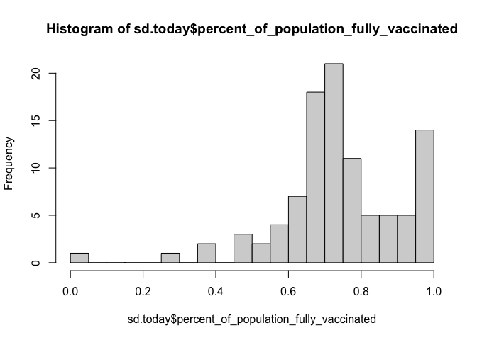
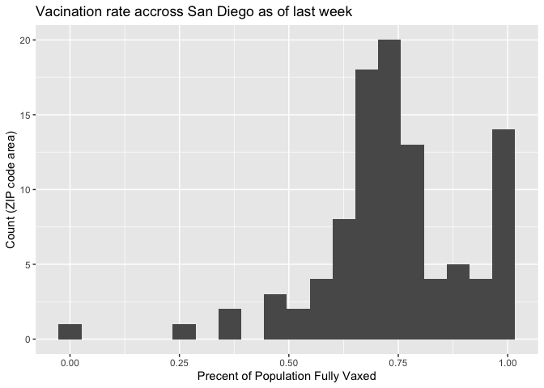
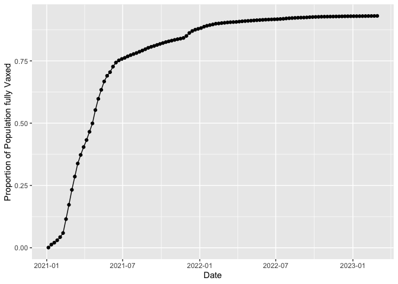
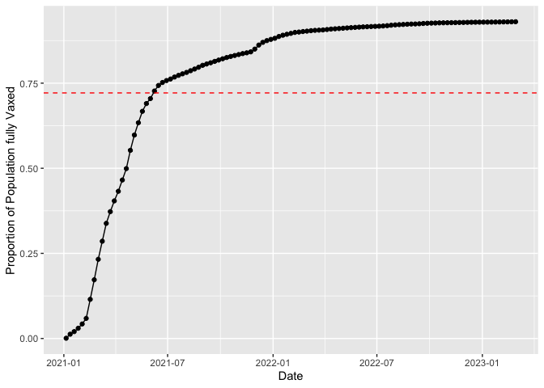
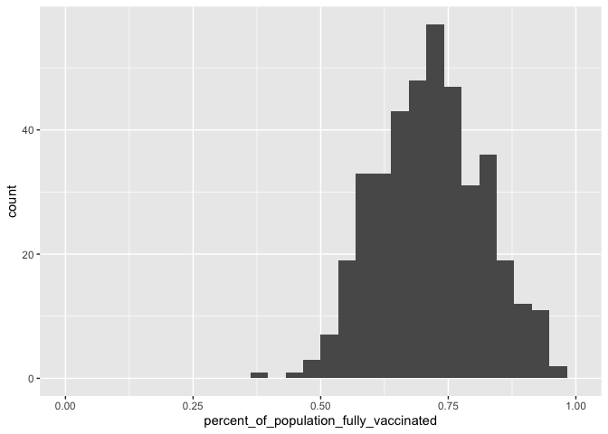
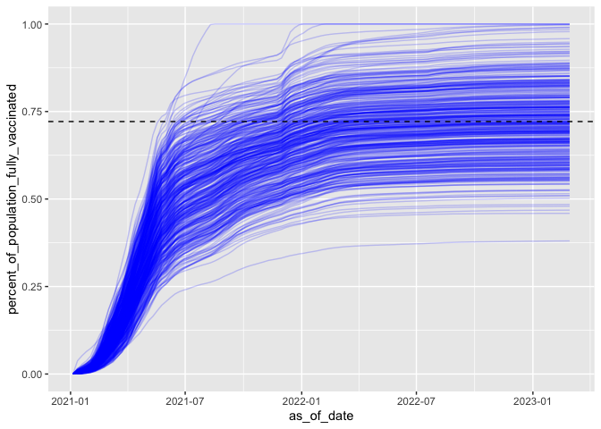

Class17: Mini Project
================
Barry (PID 911)

The goal of this hands-on mini-project is to examine and compare the
Covid-19 vaccination rates around San Diego.

We will start by downloading the most recently dated “Statewide COVID-19
Vaccines Administered by ZIP Code” CSV file from:
https://data.ca.gov/dataset/covid-19-vaccine-progress-dashboard-data-by-zip-code

# Data Import

``` r
vax <- read.csv("covid19vaccinesbyzipcode.csv")
head(vax)
```

      as_of_date zip_code_tabulation_area local_health_jurisdiction    county
    1 2021-01-05                    95446                    Sonoma    Sonoma
    2 2021-01-05                    96014                  Siskiyou  Siskiyou
    3 2021-01-05                    96087                    Shasta    Shasta
    4 2021-01-05                    96008                    Shasta    Shasta
    5 2021-01-05                    95410                 Mendocino Mendocino
    6 2021-01-05                    95527                   Trinity   Trinity
      vaccine_equity_metric_quartile                 vem_source
    1                              2 Healthy Places Index Score
    2                              2    CDPH-Derived ZCTA Score
    3                              2    CDPH-Derived ZCTA Score
    4                             NA            No VEM Assigned
    5                              3    CDPH-Derived ZCTA Score
    6                              2    CDPH-Derived ZCTA Score
      age12_plus_population age5_plus_population tot_population
    1                4840.7                 5057           5168
    2                 135.0                  135            135
    3                 513.9                  544            544
    4                1125.3                 1164             NA
    5                 926.3                  988            997
    6                 476.6                  485            499
      persons_fully_vaccinated persons_partially_vaccinated
    1                       NA                           NA
    2                       NA                           NA
    3                       NA                           NA
    4                       NA                           NA
    5                       NA                           NA
    6                       NA                           NA
      percent_of_population_fully_vaccinated
    1                                     NA
    2                                     NA
    3                                     NA
    4                                     NA
    5                                     NA
    6                                     NA
      percent_of_population_partially_vaccinated
    1                                         NA
    2                                         NA
    3                                         NA
    4                                         NA
    5                                         NA
    6                                         NA
      percent_of_population_with_1_plus_dose booster_recip_count
    1                                     NA                  NA
    2                                     NA                  NA
    3                                     NA                  NA
    4                                     NA                  NA
    5                                     NA                  NA
    6                                     NA                  NA
      bivalent_dose_recip_count eligible_recipient_count
    1                        NA                        0
    2                        NA                        0
    3                        NA                        2
    4                        NA                        2
    5                        NA                        0
    6                        NA                        0
                                                                   redacted
    1 Information redacted in accordance with CA state privacy requirements
    2 Information redacted in accordance with CA state privacy requirements
    3 Information redacted in accordance with CA state privacy requirements
    4 Information redacted in accordance with CA state privacy requirements
    5 Information redacted in accordance with CA state privacy requirements
    6 Information redacted in accordance with CA state privacy requirements

> Q1. What column details the total number of people fully vaccinated?

vax\$persons_fully_vaccinated

> Q2. What column details the Zip code tabulation area?

vax\$zip_code_tabulation_area

> Q3. What is the earliest date in this dataset?

``` r
vax$as_of_date[1]
```

    [1] "2021-01-05"

> Q4. What is the latest date in this dataset?

``` r
vax$as_of_date[nrow(vax)]
```

    [1] "2023-02-28"

We can use the skim() function for a quick overview of a new dataset
like this

``` r
skimr::skim(vax)
```

|                                                  |        |
|:-------------------------------------------------|:-------|
| Name                                             | vax    |
| Number of rows                                   | 199332 |
| Number of columns                                | 18     |
| \_\_\_\_\_\_\_\_\_\_\_\_\_\_\_\_\_\_\_\_\_\_\_   |        |
| Column type frequency:                           |        |
| character                                        | 5      |
| numeric                                          | 13     |
| \_\_\_\_\_\_\_\_\_\_\_\_\_\_\_\_\_\_\_\_\_\_\_\_ |        |
| Group variables                                  | None   |

Data summary

**Variable type: character**

| skim_variable             | n_missing | complete_rate | min | max | empty | n_unique | whitespace |
|:--------------------------|----------:|--------------:|----:|----:|------:|---------:|-----------:|
| as_of_date                |         0 |             1 |  10 |  10 |     0 |      113 |          0 |
| local_health_jurisdiction |         0 |             1 |   0 |  15 |   565 |       62 |          0 |
| county                    |         0 |             1 |   0 |  15 |   565 |       59 |          0 |
| vem_source                |         0 |             1 |  15 |  26 |     0 |        3 |          0 |
| redacted                  |         0 |             1 |   2 |  69 |     0 |        2 |          0 |

**Variable type: numeric**

| skim_variable                              | n_missing | complete_rate |     mean |       sd |    p0 |      p25 |      p50 |      p75 |     p100 | hist  |
|:-------------------------------------------|----------:|--------------:|---------:|---------:|------:|---------:|---------:|---------:|---------:|:------|
| zip_code_tabulation_area                   |         0 |          1.00 | 93665.11 |  1817.38 | 90001 | 92257.75 | 93658.50 | 95380.50 |  97635.0 | ▃▅▅▇▁ |
| vaccine_equity_metric_quartile             |      9831 |          0.95 |     2.44 |     1.11 |     1 |     1.00 |     2.00 |     3.00 |      4.0 | ▇▇▁▇▇ |
| age12_plus_population                      |         0 |          1.00 | 18895.04 | 18993.87 |     0 |  1346.95 | 13685.10 | 31756.12 |  88556.7 | ▇▃▂▁▁ |
| age5_plus_population                       |         0 |          1.00 | 20875.24 | 21105.97 |     0 |  1460.50 | 15364.00 | 34877.00 | 101902.0 | ▇▃▂▁▁ |
| tot_population                             |      9718 |          0.95 | 23372.77 | 22628.51 |    12 |  2126.00 | 18714.00 | 38168.00 | 111165.0 | ▇▅▂▁▁ |
| persons_fully_vaccinated                   |     16525 |          0.92 | 13962.33 | 15054.09 |    11 |   930.00 |  8566.00 | 23302.00 |  87566.0 | ▇▃▁▁▁ |
| persons_partially_vaccinated               |     16525 |          0.92 |  1701.64 |  2030.18 |    11 |   165.00 |  1196.00 |  2535.00 |  39913.0 | ▇▁▁▁▁ |
| percent_of_population_fully_vaccinated     |     20825 |          0.90 |     0.57 |     0.25 |     0 |     0.42 |     0.60 |     0.74 |      1.0 | ▂▃▆▇▃ |
| percent_of_population_partially_vaccinated |     20825 |          0.90 |     0.08 |     0.09 |     0 |     0.05 |     0.06 |     0.08 |      1.0 | ▇▁▁▁▁ |
| percent_of_population_with_1\_plus_dose    |     21859 |          0.89 |     0.63 |     0.24 |     0 |     0.49 |     0.67 |     0.81 |      1.0 | ▂▂▅▇▆ |
| booster_recip_count                        |     72872 |          0.63 |  5837.31 |  7165.81 |    11 |   297.00 |  2748.00 |  9438.25 |  59553.0 | ▇▂▁▁▁ |
| bivalent_dose_recip_count                  |    158664 |          0.20 |  2924.93 |  3583.45 |    11 |   190.00 |  1418.00 |  4626.25 |  27458.0 | ▇▂▁▁▁ |
| eligible_recipient_count                   |         0 |          1.00 | 12801.84 | 14908.33 |     0 |   504.00 |  6338.00 | 21973.00 |  87234.0 | ▇▃▁▁▁ |

> Q5. How many numeric columns are in this dataset?

13

> Q6. Note that there are “missing values” in the dataset. How many NA
> values there in the persons_fully_vaccinated column?

``` r
n.missing <- sum(is.na(vax$persons_fully_vaccinated))
n.missing
```

    [1] 16525

> Q7. What percent of persons_fully_vaccinated values are missing (to 2
> significant figures)?

``` r
round((n.missing / nrow(vax) )*100, 2)
```

    [1] 8.29

## Working with dates

The lubridate package makes working with dates and times n R much less
of a pain. Let’s have a first play with this package here.

``` r
library(lubridate)
```


    Attaching package: 'lubridate'

    The following objects are masked from 'package:base':

        date, intersect, setdiff, union

``` r
today()
```

    [1] "2023-03-16"

We can now magicaly do math with dates

``` r
today() - ymd("2021-01-05")
```

    Time difference of 800 days

How old am I in days

``` r
today() - ymd("1978-06-22")
```

    Time difference of 16338 days

Let’s treat the whole column as date format

``` r
# Specify that we are using the year-month-day format
vax$as_of_date <- ymd(vax$as_of_date)
```

How many days have passed since the first vaccination reported in this
dataset?

``` r
today() - vax$as_of_date[1]
```

    Time difference of 800 days

> Q. How many days does the dataset span.

``` r
vax$as_of_date[nrow(vax)] - vax$as_of_date[1]
```

    Time difference of 784 days

> Q9. How many days ago was the dataset updated?

``` r
today() - vax$as_of_date[nrow(vax)]
```

    Time difference of 16 days

> Q10. How many unique dates are in the dataset (i.e. how many different
> dates are detailed)?

``` r
length(unique(vax$as_of_date))
```

    [1] 113

``` r
library(dplyr)
```


    Attaching package: 'dplyr'

    The following objects are masked from 'package:stats':

        filter, lag

    The following objects are masked from 'package:base':

        intersect, setdiff, setequal, union

``` r
n_distinct(vax$as_of_date)
```

    [1] 113

# Working with ZIP codes

ZIP codes are also rather annoying things wo work with as they are
numeric but not in the conventional sense of doing math.

Just like dates we have special packages to help us work with ZIP codes.

``` r
library(zipcodeR)
```

``` r
geocode_zip('92037')
```

    # A tibble: 1 × 3
      zipcode   lat   lng
      <chr>   <dbl> <dbl>
    1 92037    32.8 -117.

Calculate the distance between the centroids of any two ZIP codes in
miles, e.g.

``` r
zip_distance('92037','92109')
```

      zipcode_a zipcode_b distance
    1     92037     92109     2.33

More usefully, we can pull census data about ZIP code areas (including
median household income etc.). For example:

``` r
reverse_zipcode(c('92037', "92109") )
```

    # A tibble: 2 × 24
      zipcode zipcode_…¹ major…² post_…³ common_c…⁴ county state   lat   lng timez…⁵
      <chr>   <chr>      <chr>   <chr>       <blob> <chr>  <chr> <dbl> <dbl> <chr>  
    1 92037   Standard   La Jol… La Jol… <raw 20 B> San D… CA     32.8 -117. Pacific
    2 92109   Standard   San Di… San Di… <raw 21 B> San D… CA     32.8 -117. Pacific
    # … with 14 more variables: radius_in_miles <dbl>, area_code_list <blob>,
    #   population <int>, population_density <dbl>, land_area_in_sqmi <dbl>,
    #   water_area_in_sqmi <dbl>, housing_units <int>,
    #   occupied_housing_units <int>, median_home_value <int>,
    #   median_household_income <int>, bounds_west <dbl>, bounds_east <dbl>,
    #   bounds_north <dbl>, bounds_south <dbl>, and abbreviated variable names
    #   ¹​zipcode_type, ²​major_city, ³​post_office_city, ⁴​common_city_list, …

# Focus on the San Diego area

Let’s now focus in on the San Diego County area by restricting ourselves
first to vax\$county == “San Diego” entries. We have two main choices on
how to do this. The first using base R the second using the dplyr
package:

``` r
# Subset to San Diego county only areas
sd <- vax[ vax$county == "San Diego" , ]
nrow(sd)
```

    [1] 12091

It is time to revisit the most awesome **dplyr** package. Using dplyr is
often more convenient when we are subsetting across multiple criteria -
for example all San Diego county areas with a population of over 10,000.

``` r
library(dplyr)

sd.10 <- filter(vax, county == "San Diego" &
                age5_plus_population > 10000)

nrow(sd.10)
```

    [1] 8588

> How many ZIP code areas are we dealing with?

``` r
n_distinct(sd.10$zip_code_tabulation_area)
```

    [1] 76

> Q11. How many distinct zip codes are listed for San Diego County?

``` r
n_distinct(sd$zip_code_tabulation_area)
```

    [1] 107

> Q12. What San Diego County Zip code area has the largest 12 +
> Population in this dataset?

``` r
ind <- which.max(sd$age12_plus_population)
sd$zip_code_tabulation_area[ind]
```

    [1] 92154

``` r
reverse_zipcode("92154")
```

    # A tibble: 1 × 24
      zipcode zipcode_…¹ major…² post_…³ common_c…⁴ county state   lat   lng timez…⁵
      <chr>   <chr>      <chr>   <chr>       <blob> <chr>  <chr> <dbl> <dbl> <chr>  
    1 92154   Standard   San Di… San Di… <raw 21 B> San D… CA     32.6  -117 Pacific
    # … with 14 more variables: radius_in_miles <dbl>, area_code_list <blob>,
    #   population <int>, population_density <dbl>, land_area_in_sqmi <dbl>,
    #   water_area_in_sqmi <dbl>, housing_units <int>,
    #   occupied_housing_units <int>, median_home_value <int>,
    #   median_household_income <int>, bounds_west <dbl>, bounds_east <dbl>,
    #   bounds_north <dbl>, bounds_south <dbl>, and abbreviated variable names
    #   ¹​zipcode_type, ²​major_city, ³​post_office_city, ⁴​common_city_list, …

> Q13. What is the overall average “Percent of Population Fully
> Vaccinated” value for all San Diego “County” as of THE MOST RECENT
> DATE -“2022-11-15”-?

``` r
vax$as_of_date[nrow(vax)]
```

    [1] "2023-02-28"

“2023-02-28”

``` r
##sd$as_of_date
sd.today <- filter(sd, as_of_date == "2023-02-28")
```

``` r
mean(sd.today$percent_of_population_fully_vaccinated, na.rm=T)
```

    [1] 0.7400878

> Q14 Q14. Using either ggplot or base R graphics make a summary figure
> that shows the distribution of Percent of Population Fully Vaccinated
> values as of 2023-02-28

``` r
hist(sd.today$percent_of_population_fully_vaccinated, breaks=20)
```



``` r
library(ggplot2)

ggplot(sd.today) +
  aes(percent_of_population_fully_vaccinated) +
  geom_histogram(bins=20) +
  labs(title="Vacination rate accross San Diego as of last week") +
  xlab("Precent of Population Fully Vaxed") +
  ylab("Count (ZIP code area)")
```

    Warning: Removed 8 rows containing non-finite values (`stat_bin()`).



# Focus on UCSD/La Jolla

UC San Diego resides in the 92037 ZIP code area and is listed with an
age 5+ population size of 36,144.

``` r
ucsd <- filter(sd, zip_code_tabulation_area=="92037")
ucsd[1,]$age5_plus_population
```

    [1] 36144

> Q15. Using ggplot make a graph of the vaccination rate time course for
> the 92037 ZIP code area:

``` r
ucplot <- ggplot(ucsd) +
  aes(as_of_date, percent_of_population_fully_vaccinated) +
  geom_point() +
  geom_line() +
  xlab("Date") +
  ylab("Proportion of Population fully Vaxed")

ucplot
```



## Comparing to similar sized areas

Let’s return to the full dataset and look across every zip code area
with a population at least as large as that of 92037 on the most recent
date (2023-02-28).

``` r
# Subset to all CA areas with a population as large as 92037
vax.36 <- filter(vax, age5_plus_population > 36144 &
                as_of_date == "2023-02-28")
```

> Q16. Calculate the mean “Percent of Population Fully Vaccinated” for
> ZIP code areas with a population as large as 92037 (La Jolla)
> as_of_date “2023-02-28”. Add this as a straight horizontal line to
> your plot from above with the geom_hline() function?

``` r
ave <- mean(vax.36$percent_of_population_fully_vaccinated)
ave
```

    [1] 0.7213331

``` r
ucplot + geom_hline(yintercept=ave, col="red", linetype=2)
```



> Q17. What is the 6 number summary (Min, 1st Qu., Median, Mean, 3rd
> Qu., and Max) of the “Percent of Population Fully Vaccinated” values
> for ZIP code areas with a population as large as 92037 (La Jolla)
> as_of_date “2023-02-28”?

``` r
summary(vax.36$percent_of_population_fully_vaccinated)
```

       Min. 1st Qu.  Median    Mean 3rd Qu.    Max. 
     0.3804  0.6457  0.7181  0.7213  0.7907  1.0000 

> Q18. Using ggplot generate a histogram of this data.

``` r
ggplot(vax.36) +
  aes(percent_of_population_fully_vaccinated) +
  geom_histogram() +
  xlim(0,1)
```

    `stat_bin()` using `bins = 30`. Pick better value with `binwidth`.

    Warning: Removed 2 rows containing missing values (`geom_bar()`).



> Q19. Is the 92109 and 92040 ZIP code areas above or below the average
> value you calculated for all these above?

``` r
x <- filter(vax.36, zip_code_tabulation_area %in% c("92109", "92040"))
x$percent_of_population_fully_vaccinated
```

    [1] 0.694572 0.550296

> Q20. Finally make a time course plot of vaccination progress for all
> areas in the full dataset with a age5_plus_population \> 36144.

``` r
vax.36.all <- filter(vax, age5_plus_population > 36144)


ggplot(vax.36.all) +
  aes(as_of_date,
      percent_of_population_fully_vaccinated, 
      group=zip_code_tabulation_area) +
  geom_line(alpha=0.2, col="blue") +
  geom_hline(yintercept = ave, linetype=2)
```

    Warning: Removed 183 rows containing missing values (`geom_line()`).


